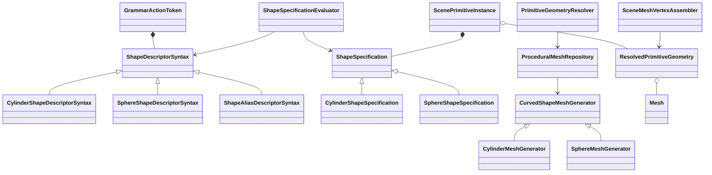

# ProGen3D Curved Primitive Extension Implementation Plan

## Document Control

- **Date:** August 21, 2026
- **Status:** Implemented and release-validated on August 21, 2026.
- **Primary objective:** Introduce a compact curved-shape algebra based on normalized Cylinder and Sphere domains without creating one C++ mesh class for every named shape.
- **Required first boundary:** Repair the existing Cylinder and Sphere preview/export/bounds/picking path before accepting parameterized curved-shape grammar.
- **Primary grammar form:** A named shape descriptor inside `I(...)`.
- **Compatibility requirement:** Existing Cube, Cylinder, Sphere, material, alpha, texture-scale, transformation, and temporal grammar behavior must remain valid.

### Implementation Evidence

- Canonical Cylinder and Sphere descriptors, validation, alias expansion, deterministic mesh generation, half-space clipping, topology analysis, volume evidence, and collision policy are implemented under `include/geometry`, `src/geometry`, `include/grammar`, and `src/grammar`.
- Preview, export, picking, bounds, mass, and scene inspection consume the resolved primitive geometry stored on each instance; Cube retains its specialized preview path.
- Procedural catalog aliases remain descriptor expansions and do not own mesh generators.
- Boundary coverage includes minimum tessellation, exact and near-zero sweeps, thin shells, centre and near-tangent chords, tangent/full/outside clips, coincident slabs, invalid domains, and geometry-budget rejection.
- `./tests/run_release_checks.sh` passed from a clean build, including the editor architecture suite and both GUI smoke modes.
- The supervised `progen3d-editor-gui.service` was restarted after validation and remained active with `NRestarts=0`; its running executable matched the built SHA-256 `505636c2e7a2a8262acef1c5e7e69f3975332d01251cd2f204682c75eb885431`.

Sections describing the repository baseline preserve the pre-implementation state that motivated this plan.

## 1. Outcome

ProGen3D should represent curved primitives as:

```text
base family
+ normalized parameter domain
+ radial interval or wall thickness
+ optional half-space restrictions
+ topology
+ closure policy
+ tessellation
```

Common names such as `Hemisphere`, `Tube`, `Bowl`, `DSection`, and `SphereCap` will be catalog aliases that expand into the canonical representation. They will not own separate mesh-generation implementations.

The first complete delivery covered by this plan includes:

1. correct generic mesh handling for existing full Cylinder and Sphere instances;
2. evaluated Cylinder and Sphere shape specifications;
3. backwards-compatible nested shape syntax inside `I(...)`;
4. partial, hollow, sector, chord, cap, slab, and open/closed variants;
5. deterministic preview, picking, bounds, and PLY export;
6. watertightness, volume, and staged collision policies;
7. procedural catalog aliases backed by the same canonical descriptors.

Direct `Extrude(...)`, direct `Revolve(...)`, and general Boolean CSG remain later projects.

## 2. Confirmed Repository Baseline

### 2.1 Grammar Ownership

The parser currently accepts only six built-in names in `is_supported_instance_type_name()`:

- `Cube`
- `CubeX`
- `CubeY`
- `CubeZ`
- `Cylinder`
- `Sphere`

Evidence: `src/Grammar.cpp:1863`.

The `I` parser currently:

1. reads one fixed primitive name;
2. rejects any other identifier;
3. parses one to three remaining arguments as appearance values;
4. has no shape-descriptor AST or nested geometry option parser.

Evidence: `src/Grammar.cpp:2998`.

`GrammarActionToken` stores `instance_type`, `material_name`, three variable slots, and numeric appearance arguments. It has no object representing geometry syntax or evaluated geometry.

Evidence: `include/grammar.h:44` and `include/grammar.h:177`.

During execution, `GrammarActionToken::performAction()` resolves a shared mesh by primitive name, transforms a mesh copy for the legacy accumulated scene, and independently calls `SceneGenerationContext::addPrimitive()` with only the type and appearance values.

Evidence: `src/Grammar.cpp:2665`.

### 2.2 Existing Mesh Families

`Mesh::getSharedInstance()` owns one static Cube, Cylinder, and Sphere mesh.

Evidence: `src/Mesh.cpp:413`.

The existing Cylinder generator uses:

- normalized radius `0.5`;
- local Y range `0` through `1`;
- 40 circumferential divisions;
- bottom and top closure triangles.

Evidence: `src/Mesh.cpp:497`.

The existing Sphere generator uses:

- normalized radius `0.5`;
- origin-centered geometry;
- 20 polar divisions;
- 40 azimuth divisions.

Evidence: `src/Mesh.cpp:544`.

These normalized dimensions remain authoritative. External sizing continues to belong to `S(...)` and the existing scope transforms.

### 2.3 Preview and Export Integration Gap

`append_instance_vertices()` currently selects the mesh-appending path only when `is_stl_instance_type()` is true. Every other instance uses the 36-vertex base primitive buffer.

Evidence: `src/Context.cpp:2106` and `src/Context.cpp:2114`.

Consequences in the current source:

- built-in Cylinder and Sphere reserve 36 vertices rather than their mesh face counts;
- built-in Cylinder and Sphere are passed through cube-oriented vertex transformation;
- static preview buffers receive the same incorrect representation;
- PLY export consumes the same incorrect instance-buffer geometry.

Evidence: `src/imgui_main.cpp:4233`, `src/Context.cpp:2395`, and `src/Context.cpp:2494`.

The code contains an STL-specific mesh path, but `Mesh::isStlInstanceType()` currently always returns false in this snapshot. The repair must therefore be representation-based rather than expressed as “STL versus non-STL.”

Evidence: `src/Mesh.cpp:445`.

### 2.4 Bounds, Picking, Collision, and Mass

Collision geometry uses a triangle mesh only for the STL-classified path. Every other type receives a transformed box hull.

Evidence: `src/Context.cpp:911`.

Preview picking uses `getInstanceCollisionGeometry()` and performs triangle intersection when the geometry kind is a triangle mesh. Therefore, routing procedural curves through a resolved mesh can improve picking without creating a separate picking system.

Evidence: `src/imgui_main.cpp:3901`.

Scene bounds and Fit currently derive from collision geometry, so Cylinder and Sphere bounds are also box-derived.

Evidence: `src/Context.cpp:2445` and `src/Context.cpp:2464`.

Simulation collision eligibility is explicitly cube-only.

Evidence: `src/Context.cpp:314`.

Density-derived mass is also cube-only, despite an existing generic signed-volume function for triangle buffers.

Evidence: `src/Context.cpp:141` and `src/Context.cpp:2187`.

### 2.5 Existing Useful Infrastructure

The repository already provides:

- `Mesh` vertices, faces, normals, texture coordinates, triangle bounds, and BVH storage;
- affine transform and safe normal-transform functions;
- triangle-based picking;
- triangle-based center-of-mass calculation;
- signed tetrahedral volume calculation;
- material-batched preview uploads;
- PLY export from instance-buffer geometry;
- grammar expression evaluation with lexical variables and immutable `t`;
- diagnostic source ranges;
- a part-class catalog and editor autocomplete path;
- focused architecture harnesses and a clean release gate.

The implementation should extend these systems rather than introduce parallel render, export, or expression engines.

## 3. Locked Semantic Decisions

These decisions should be treated as contracts before implementation begins.

### 3.1 Canonical Families

The first canonical curved families are:

```text
Cylinder
Sphere
```

Aliases never introduce a new mesh family. They expand to one of these two specifications.

### 3.2 Normalized Geometry

Cylinder defaults:

```text
outer radius = 0.5
inner radius = 0
axial interval = [0, 1]
azimuth = start 0 degrees, sweep 360 degrees
segments = 40 circumferential, 1 axial
topology = solid
closure = all
```

Sphere defaults:

```text
outer radius = 0.5
inner radius = 0
polar interval = [0, 180] degrees
azimuth = start 0 degrees, sweep 360 degrees
segments = 40 azimuth, 20 polar
topology = solid
closure = all
```

`S(...)` remains the only external-dimension control. Nonuniform scaling intentionally produces elliptical cylinders, ellipsoids, and nonuniform shells.

### 3.3 Grammar Units

- `azimuth(...)` and `polar(...)` use degrees.
- Geometry generators receive explicitly named radians values only after evaluation and validation.
- `radial(inner outer)` values are fractions of the canonical family radius.
- `wall(thickness)` sets `radial_min = 1 - thickness` and `radial_max = 1`.
- `clip(... offset ...)` and `chord(... offset ...)` offsets are normalized by the evaluated outer radius.
- `axial(min max)` uses the canonical Cylinder Y domain where `0` is the bottom and `1` is the top.

### 3.4 Topology Rules

```text
surface = one outer mathematical skin; no enclosed-volume promise
solid   = material from radius zero to the outer skin
shell   = material between distinct inner and outer skins
```

Canonicalization rules:

- omitted topology defaults to `solid`;
- `wall(...)` implies `shell`;
- `radial(inner outer)` with `inner > 0` implies `shell` when topology is omitted;
- explicit `solid` with `inner > 0` is invalid;
- explicit `shell` requires `0 < inner < outer <= 1`;
- `surface` emits the outer skin and rejects `wall(...)` or a nonzero radial minimum in the first implementation.

### 3.5 Closure Rules

The closure policy is a set containing:

```text
axial
angular
clip
rim
```

`all` expands to every boundary component relevant to the family and domain. `none` expands to an empty set. `all` and `none` cannot be combined with other values.

Closure requests describe generated boundary surfaces. They do not automatically imply that the result is watertight. Watertightness is measured from the generated mesh and stored as derived evidence.

### 3.6 Parameter Validation

Initial limits:

- radial values: finite and within `[0, 1]`;
- Cylinder axial values: finite and within `[0, 1]`, with `min < max`;
- azimuth sweep: finite and within `(0, 360]` for the first implementation;
- polar values: finite and within `[0, 180]`, with `min < max`;
- clip normal: finite and nonzero, then normalized;
- normalized clip/chord offset: finite and within `[-1, 1]` unless an explicit empty/full-result diagnostic is being tested;
- circumferential/azimuth segments: integer in `[3, 512]`;
- axial segments: integer in `[1, 256]`;
- polar segments: integer in `[2, 256]`;
- total generated vertices and triangles: bounded by explicit per-shape budgets.

Duplicate mutually exclusive options are errors. Examples include `radial` plus `wall`, two topology declarations, or two segment declarations.

### 3.7 Expressions and Determinism

Shape numeric fields retain expression text during parsing and are evaluated during grammar expansion in the same lexical environment as existing action arguments.

This permits variables and `t` without adding a second expression evaluator.

The mesh generators must:

- consume no random values;
- iterate clips and surfaces in stable order;
- produce stable vertex and triangle ordering;
- produce identical topology hashes for identical evaluated specifications.

### 3.8 Appearance Compatibility

The parser must preserve all current forms, including legacy material indices and positional alpha/texture-scale arguments.

New named appearance forms are added without forcing migration:

```p3d
material(name)
alpha(expression)
texscale(expression)
```

Named and positional forms for the same appearance property cannot be mixed in one instance.

## 4. Target Object Model

The design separates parsed syntax, evaluated shape meaning, resolved geometry, generation services, and runtime instances.

### 4.1 Grammar Syntax Models

`ShapeDescriptorSyntax` is the conceptual base for parsed curved-shape syntax.

Concrete syntax classes:

- `CylinderShapeDescriptorSyntax`
- `SphereShapeDescriptorSyntax`
- `ShapeAliasDescriptorSyntax`, added when catalog aliases are enabled

Supporting value models:

- `GeometryExpression` — immutable expression source text;
- `PlaneClipDescriptorSyntax` — normal, offset, and retained-side expressions;
- `ChordDescriptorSyntax` — angle, offset, and retained side;
- `ShapeClosureSyntax` — requested closure names;
- `ShapeTessellationSyntax` — segment expressions.

Inheritance is appropriate here because Cylinder and Sphere descriptor syntax are both genuine shape descriptors with different valid option sets.

`GrammarActionToken` owns one optional `ShapeDescriptorSyntax`. A bare `Cylinder` or `Sphere` produces the same syntax object with defaults rather than bypassing the model.

### 4.2 Evaluated Geometry Models

`ShapeSpecification` is the conceptual base for validated evaluated curved shapes.

Concrete evaluated classes:

- `CylinderShapeSpecification`
- `SphereShapeSpecification`

Supporting value models:

- `RadialDomainSpecification`
- `AxialDomainSpecification`
- `AngularDomainSpecification`
- `PolarDomainSpecification`
- `PlaneClipSpecification`
- `ShapeClosurePolicy`
- `ShapeTessellation`
- `ShapeTopology`
- `ClipRetainedSide`

Every evaluated field is finite, normalized, and semantically valid. Mesh generators never receive unchecked expression text.

### 4.3 Resolved Geometry Models

`ResolvedPrimitiveGeometry` contains:

- a shared immutable `Mesh`;
- local bounds;
- face-aligned `MeshSurfaceTag` values;
- watertightness evidence;
- optional local signed volume;
- collision policy metadata;
- deterministic topology hash.

`ScenePrimitiveInstance` composes:

- the evaluated `ShapeSpecification`, when procedural;
- a shared `ResolvedPrimitiveGeometry`;
- existing transforms, material, source range, simulation, and selection state.

The instance type string remains useful for presentation and backwards compatibility, but geometry behavior is no longer selected from the string alone.

### 4.4 Service Classes

- `ShapeSpecificationParser` parses only nested shape and named appearance syntax.
- `ShapeSpecificationEvaluator` evaluates stored expressions through the existing grammar evaluation context.
- `ShapeSpecificationValidator` canonicalizes and validates evaluated values.
- `PrimitiveGeometryResolver` resolves Cube, built-in curves, parameterized curves, aliases, and imported meshes into `ResolvedPrimitiveGeometry`.
- `ProceduralMeshRepository` provides a bounded per-generation cache keyed by canonical evaluated specifications.
- `CurvedShapeMeshGenerator` is the abstract conceptual generator category.
- `CylinderMeshGenerator` and `SphereMeshGenerator` are concrete generators.
- `HalfSpaceMeshClipper` clips triangle meshes and creates tagged intersection boundaries when requested.
- `MeshTopologyAnalyzer` measures boundary edges, manifold incidence, winding, degenerate triangles, and signed volume.
- `SceneMeshVertexAssembler` transforms resolved mesh triangles into the existing preview/export vertex layout.
- `ShapeAliasExpansionService` expands catalog aliases into canonical descriptor syntax.

### 4.5 Relationships



## 5. Grammar Contract

### 5.1 Canonical Form

```p3d
I(
    Cylinder(
        radial(0.70 1.00)
        azimuth(15 220)
        topology(shell)
        close(all)
        segments(64 1)
    )
    material(steelshinyroughmetal)
    alpha(1)
    texscale(0.5)
)
```

### 5.2 Backwards-Compatible Forms

These remain valid and compile to default specifications:

```p3d
I(Cylinder material(lightgreymattemetal) 1 0.5)
I(Sphere material(whiteglossyceramic) 1 1)
I(Cube material(plaster))
```

### 5.3 Parser Strategy

The `I` parser becomes a structured sequence:

1. consume `I` or `!I` and the outer opening parenthesis;
2. parse a shape identifier;
3. when the next token is `(`, delegate to `ShapeSpecificationParser`;
4. otherwise construct the default bare shape descriptor;
5. parse appearance arguments using a dedicated appearance parser;
6. require the outer closing parenthesis;
7. attach the complete source range to the token.

The shape parser consumes option names and their balanced argument lists. It does not pass an entire nested descriptor through `parse_expression_argument()`.

### 5.4 Initial Cylinder Options

```text
radial(inner outer)
wall(thickness)
axial(min max)
azimuth(start sweep)
chord(normal_angle offset side)
clip(nx ny nz offset side)
topology(surface|solid|shell)
close(none|all|axial|angular|clip|rim ...)
segments(circumferential [axial])
mapping(triplanar|cylindrical)
```

Multiple `clip(...)` options are represented as an ordered list. `chord(...)` is canonicalized into a Cylinder-local vertical plane clip while retaining its semantic source tag.

### 5.5 Initial Sphere Options

```text
radial(inner outer)
wall(thickness)
polar(min max)
azimuth(start sweep)
clip(nx ny nz offset side)
slab(nx ny nz min_offset max_offset)
topology(surface|solid|shell)
close(none|all|angular|clip|rim ...)
segments(azimuth [polar])
mapping(triplanar|spherical)
```

`slab(...)` canonicalizes into two ordered plane clips.

### 5.6 Diagnostics

Diagnostics must identify:

- unknown family or option;
- option not supported by the selected family;
- duplicate or conflicting option;
- wrong argument count;
- invalid identifier such as a topology or side name;
- expression evaluation failure;
- non-finite result;
- invalid interval or segment count;
- zero clip normal;
- empty, full, tangent, or degenerate clip result;
- requested closure that cannot be generated consistently;
- per-shape vertex or triangle budget violation.

Failed shape evaluation must preserve the last valid preview through the existing regeneration result boundary.

## 6. Runtime Data Flow

```text
grammar source
  -> ShapeSpecificationParser
  -> ShapeDescriptorSyntax or ShapeAliasDescriptorSyntax stored on GrammarActionToken
  -> ShapeAliasExpansionService when an alias is present
  -> canonical ShapeDescriptorSyntax
  -> rule expansion and ShapeSpecificationEvaluator
  -> validated ShapeSpecification
  -> PrimitiveGeometryResolver
  -> per-generation ProceduralMeshRepository
  -> ResolvedPrimitiveGeometry
  -> ScenePrimitiveInstance
  -> preview / picking / bounds / export / mass / collision consumers
```

No preview, export, picking, mass, or collision system regenerates a curved mesh independently.

## 7. Implementation Milestones

## Milestone 0: Capture Curved-Primitive Baseline

### Tasks

1. Run `./tests/run_p2_checks.sh`.
2. Run `./tests/run_editor_architecture_checks.sh`.
3. Run both GUI smoke modes.
4. Export one Cube, Cylinder, and Sphere to PLY.
5. Record source mesh vertex/face counts and topology hashes for the current normalized Cylinder and Sphere.
6. Record current preview-buffer counts, export counts, bounds, and picking behavior to demonstrate the known mismatch.
7. Add small example grammars for the three baseline shapes without changing semantics.

### Acceptance Gates

- The pre-change release gate passes.
- Existing normalized Cylinder and Sphere source meshes are reproducibly characterized.
- The preview/export mismatch is represented by a failing regression test before repair.
- No production source changes are included in the baseline commit or evidence record.

## Milestone 1: Unify Existing Mesh Geometry

This is the mandatory first release boundary.

### Tasks

1. Add `ResolvedPrimitiveGeometry` and an explicit geometry representation category.
2. Make bare Cylinder and Sphere resolve to their existing shared `Mesh` instances.
3. Rename `append_stl_vertices()` to `append_mesh_vertices()` and remove STL-specific assumptions.
4. Make mesh vertex assembly use:
   - mesh face counts;
   - mesh vertices;
   - vertex normals when available;
   - face normals as fallback;
   - mesh texture coordinates when available;
   - the existing planar/triplanar fallback otherwise.
5. Keep Cube, CubeX, CubeY, and CubeZ on the specialized split-transform and dynamic-cube paths.
6. Make `vertex_count_for_instance()` derive mesh counts from the resolved representation.
7. Make PLY export consume the same resolved geometry as preview.
8. Build instance bounds from transformed resolved-mesh vertices.
9. Build picking triangle geometry from resolved meshes for Cylinder and Sphere.
10. Separate “has geometry for bounds/picking” from “eligible for simulation collision.”
11. Preserve the legacy accumulated `context->getScene()` mesh only while required; ensure it receives the same resolved mesh and document its eventual removal.

### Acceptance Gates

- Bare Cylinder preview uses the existing Cylinder mesh rather than 36 cube vertices.
- Bare Sphere preview uses the existing Sphere mesh rather than 36 cube vertices.
- Preview and PLY export report matching triangle counts.
- Camera Fit uses actual curved-mesh bounds.
- Picking uses actual curved triangles rather than a box hull.
- Cubes retain their existing preview, split-transform, export, and simulation behavior.
- Existing Cylinder and Sphere grammar remains unchanged.
- The complete release gate passes before shape syntax work begins.

## Milestone 2: Introduce Shape Syntax and Evaluated Specifications

### Tasks

1. Add the syntax and evaluated model classes described in Section 4.
2. Add deep-copy or immutable shared ownership for shape syntax during token cloning.
3. Extend token printing to emit a stable canonical descriptor.
4. Implement `ShapeSpecificationParser` for Cylinder and Sphere option vocabularies.
5. Implement a dedicated instance appearance parser that preserves legacy positional forms.
6. Implement `ShapeSpecificationEvaluator` through the existing checked expression evaluation path.
7. Implement `ShapeSpecificationValidator` and canonicalization rules.
8. Store the evaluated specification on the expanded token and then on `ScenePrimitiveInstance`.
9. Add source diagnostics for every invalid option and boundary condition.
10. Add a canonical `ShapeSpecificationKey` using normalized values, stable clip order, integer tessellation, and exact float bit patterns after canonicalization.

### Acceptance Gates

- Bare Cylinder and Sphere produce default specifications identical to Milestone 1 geometry.
- Nested Cylinder and Sphere syntax parses without changing Cube syntax.
- Variables, rule parameters, random declarations, and immutable `t` evaluate through the existing lexical environment.
- Parsing has no random side effects.
- Invalid specifications block generation before geometry mutation.
- Token clone, print, and source-range behavior remain deterministic.
- Existing material, alpha, and texture-scale grammars remain valid.

## Milestone 3: Implement the Cylinder Domain Engine

### Delivery Order

1. full disk extrusion;
2. axial restriction;
3. annulus extrusion;
4. angular sector extrusion;
5. annular sector extrusion;
6. circle-segment or chord extrusion;
7. annular chord extrusion;
8. ordered additional plane clips;
9. closure components.

### Tasks

1. Implement `CylinderMeshGenerator` from normalized radial, axial, and angular domains.
2. Generate separate surface regions for outer, inner, axial start/end, angular start/end, clip, and rim surfaces.
3. Use duplicated vertices at hard normal boundaries.
4. Generate outward winding for all closed material boundaries.
5. Treat `chord(...)` as extrusion of the retained circle-segment region, not extrusion of the chord line.
6. Handle inner/outer chord intersection transitions explicitly.
7. Reject tangent and near-zero-area results with diagnostics unless a documented surface-only result is valid.
8. Add per-generation mesh caching.
9. Run every generated mesh through `MeshTopologyAnalyzer` in tests and optionally in debug builds.
10. Compute local signed volume for watertight results.

### Acceptance Gates

- Full default Cylinder remains geometrically compatible with the existing normalized mesh.
- Full solid volume approximates `pi / 4` within tessellation tolerance.
- Centre-chord half-cylinder volume approximates `pi / 8`.
- Shell, sector, tube-sector, chord, and chord-shell examples render and export.
- Every closed Cylinder variant has two triangle incidents per undirected edge.
- Open boundaries exactly match omitted closure components.
- No triangle has non-finite values or near-zero area.
- Identical specifications produce identical topology hashes.
- Nonuniform `S(...)` produces correct transformed bounds and determinant-scaled volume.

## Milestone 4: Implement the Sphere Domain Engine

### Delivery Order

1. full sphere;
2. radial shell;
3. polar restriction;
4. azimuth restriction;
5. hemisphere through a centre-plane clip;
6. open bowl;
7. single offset-plane cap;
8. parallel-plane slab or segment;
9. multiple ordered plane clips;
10. closure and rim surfaces.

### Tasks

1. Implement `SphereMeshGenerator` from normalized radial, polar, and azimuth domains.
2. Avoid duplicate or degenerate pole triangles.
3. Generate outer and inner spherical normals with opposite directions.
4. Generate tagged polar, angular, clip, and rim boundaries.
5. Implement `HalfSpaceMeshClipper` for arbitrary oriented local planes.
6. Reconstruct deterministic intersection loops for clip closures.
7. Triangulate clip closures with support for shell holes before enabling closed clipped shells.
8. Expand `slab(...)` to two ordered clips.
9. Validate empty, tangent, full-retention, and multi-plane cases explicitly.
10. Compute local signed volume only when the topology analyzer confirms watertightness.

### Acceptance Gates

- Full default Sphere remains geometrically compatible with the normalized baseline.
- Full solid volume approximates `pi / 6` within tessellation tolerance.
- Hemisphere volume approximates `pi / 12`.
- Shell volume approximates analytic outer-minus-inner volume.
- Hemisphere, bowl, cap, slab, wedge, patch, quarter, and octant examples render and export.
- Plane-cut caps produce planar closure normals and consistent winding.
- Closed clipped shapes are manifold and watertight.
- Open bowls expose only the requested boundary loops.
- Multiple clips execute in stable source order and produce deterministic hashes.

## Milestone 5: Normals, UVs, Surface Tags, and Catalog Aliases

### Tasks

1. Finalize `MeshSurfaceTag` values:
   - `Outer`;
   - `Inner`;
   - `AxialStart`;
   - `AxialEnd`;
   - `AngularStart`;
   - `AngularEnd`;
   - `PolarStart`;
   - `PolarEnd`;
   - indexed `Clip`;
   - `Rim`.
2. Add cylindrical and spherical UV mappings.
3. Keep existing triplanar mapping as a supported explicit mode and fallback.
4. Add a procedural catalog model separate from imported STL metadata.
5. Implement `ShapeAliasExpansionService`.
6. Add initial aliases:
   - `Tube`;
   - `CylinderSector`;
   - `DSection`;
   - `Hemisphere`;
   - `SphereCap`;
   - `SphereBowl`;
   - `SphereQuarter`;
   - `SphereOctant`.
7. Require ambiguous aliases such as `HalfCylinder` to expose or document their exact canonical expansion.
8. Add alias parameters and defaults to editor autocomplete and tooltips.
9. Preserve one material per instance for this milestone while retaining surface tags for later per-surface material work.

### Acceptance Gates

- Curved outer and inner surfaces shade smoothly.
- Cut, cap, angular, and rim boundaries retain hard normals.
- UV seams are stable and deterministic.
- Aliases expand to the same specification key and topology hash as handwritten canonical descriptors.
- No alias invokes a separate mesh generator.
- Catalog loading failure still preserves the six original built-in names.
- Existing STL catalog behavior remains independent of procedural aliases.

## Milestone 6: Volume, Mass, and Collision Policies

### Tasks

1. Add `PrimitiveVolumeEvidence` containing analytic, mesh-derived, or undefined status.
2. Prefer analytic local volumes for validated simple cases.
3. Use signed tetrahedral mesh volume for other watertight generated meshes.
4. Multiply local volume by the absolute determinant of the instance linear transform.
5. Reject density-derived mass for surface or non-watertight geometry.
6. Split picking geometry policy from simulation collision policy.
7. Enable static triangle-mesh collision for immovable procedural curves.
8. Add analytic or convex collision for full solid spheres and cylinders.
9. Add convex mesh collision for solid caps, chord cylinders, and eligible sectors.
10. Keep hollow, concave, or open dynamic shapes disabled until compound or dynamic triangle-mesh behavior is explicitly validated.
11. Surface collision-policy state in diagnostics or the scene inspector.

### Acceptance Gates

- Density-derived mass matches analytic expectations for full Cylinder, half Cylinder, full Sphere, hemisphere, and shells.
- Open surfaces produce a clear undefined-volume diagnostic rather than a cube-derived mass.
- Static bowls and shells use triangle geometry when collision is enabled.
- A hollow sphere never silently receives a solid outer-sphere collider.
- Dynamic collision is enabled only for geometry with an explicit supported policy.
- Existing cube collision and physics tests remain unchanged.

## Milestone 7: Full Application Verification and Documentation

### Tasks

1. Add example grammars for every supported canonical form and alias.
2. Add grammar editor tooltip and autocomplete documentation.
3. Document normalized units, closure semantics, topology, and transform behavior.
4. Add ordinary GUI smoke coverage for one Cylinder sector and one Sphere cap.
5. Add temporal smoke coverage for a bounded expression-driven sweep or clip.
6. Add PLY regression exports and topology hashes.
7. Run the focused shape suites.
8. Run `./tests/run_release_checks.sh` from a clean build.
9. Restart `progen3d-editor-gui.service` only after the complete release gate passes.
10. Verify PID, restart policy, restart count, recent logs, and the exact running executable hash.

### Acceptance Gates

- Existing grammars remain valid without migration.
- All canonical examples parse, render, pick, Fit, and export.
- Invalid examples produce source-located diagnostics.
- Determinism, topology, metric, transform, and compatibility suites pass.
- Both GUI smoke modes pass.
- The complete release gate passes from a clean application build.
- The supervised GUI remains active with no restart loop or runtime geometry error.

## 8. Recommended Release Boundaries

### Release A: Existing Curves Correctness

Includes Milestones 0 and 1 only.

This release fixes current Cylinder and Sphere preview, export, bounds, and picking without adding grammar syntax.

### Release B: Canonical Cylinder Algebra

Includes Milestones 2 and 3.

This release introduces the canonical descriptor grammar and Cylinder variants.

### Release C: Canonical Sphere Algebra

Includes Milestone 4.

This release adds Sphere shells, caps, slabs, wedges, and clips.

### Release D: Catalog and Physical Semantics

Includes Milestones 5 through 7.

This release adds aliases, finalized surface metadata, volume, mass, collision policy, documentation, and full runtime verification.

Each release must pass the complete existing release gate. Later release work must not be used to justify an incomplete earlier correctness boundary.

## 9. Proposed File Map

### 9.1 New Grammar Models and Services

```text
include/grammar/model/GeometryExpression.h
include/grammar/model/ShapeDescriptorSyntax.h
include/grammar/model/CylinderShapeDescriptorSyntax.h
include/grammar/model/SphereShapeDescriptorSyntax.h
include/grammar/model/ShapeAliasDescriptorSyntax.h
include/grammar/model/PlaneClipDescriptorSyntax.h
include/grammar/service/ShapeSpecificationParser.h
include/grammar/service/ShapeSpecificationEvaluator.h
src/grammar/service/ShapeSpecificationParser.cpp
src/grammar/service/ShapeSpecificationEvaluator.cpp
```

### 9.2 New Geometry Models

```text
include/geometry/model/ShapeSpecification.h
include/geometry/model/CylinderShapeSpecification.h
include/geometry/model/SphereShapeSpecification.h
include/geometry/model/RadialDomainSpecification.h
include/geometry/model/AxialDomainSpecification.h
include/geometry/model/AngularDomainSpecification.h
include/geometry/model/PolarDomainSpecification.h
include/geometry/model/PlaneClipSpecification.h
include/geometry/model/ShapeClosurePolicy.h
include/geometry/model/ShapeTessellation.h
include/geometry/model/MeshSurfaceTag.h
include/geometry/model/ResolvedPrimitiveGeometry.h
```

### 9.3 New Geometry Services

```text
include/geometry/service/ShapeSpecificationValidator.h
include/geometry/service/PrimitiveGeometryResolver.h
include/geometry/service/ProceduralMeshRepository.h
include/geometry/service/CurvedShapeMeshGenerator.h
include/geometry/service/CylinderMeshGenerator.h
include/geometry/service/SphereMeshGenerator.h
include/geometry/service/HalfSpaceMeshClipper.h
include/geometry/service/MeshTopologyAnalyzer.h
include/geometry/service/SceneMeshVertexAssembler.h
include/geometry/service/ShapeAliasExpansionService.h
src/geometry/service/*.cpp
```

### 9.4 Existing Files Expected to Change

```text
include/grammar.h
src/Grammar.cpp
include/Context.h
src/Context.cpp
include/Mesh.h
src/Mesh.cpp
include/StlCatalog.h
src/StlCatalog.cpp
src/imgui_main.cpp
include/imgui_render.h
src/imgui_render.cpp
Makefile
tests/run_editor_architecture_checks.sh
tests/run_release_checks.sh
tests/README.md
```

`StlCatalog` should not be renamed as part of the first geometry releases unless the procedural catalog integration proves that a broader catalog rename is necessary. Avoid mixing a large catalog migration into the mesh correctness boundary.

## 10. Test Plan

### 10.1 New Focused Harnesses

```text
tests/shape_specification_parser_harness.cpp
tests/shape_specification_evaluator_harness.cpp
tests/primitive_geometry_resolver_harness.cpp
tests/cylinder_mesh_generator_harness.cpp
tests/sphere_mesh_generator_harness.cpp
tests/mesh_topology_analyzer_harness.cpp
tests/curved_shape_scene_geometry_harness.cpp
tests/procedural_shape_catalog_harness.cpp
```

Each harness receives a dedicated `run_*_checks.sh` entry and is added to `run_editor_architecture_checks.sh`.

### 10.2 Compatibility Matrix

| Area | Required result |
|---|---|
| Bare Cube | Existing specialized path and behavior unchanged |
| Bare Cylinder | Existing normalized source mesh used everywhere |
| Bare Sphere | Existing normalized source mesh used everywhere |
| Material syntax | Existing named, deferred, and indexed forms unchanged |
| Positional appearance | Existing alpha and texture-scale positions unchanged |
| Named appearance | `alpha(...)` and `texscale(...)` map to the same values |
| Scope transforms | Existing translation, scales, secondary scales, and rotations remain valid |
| Temporal grammar | Existing `t` behavior and design nonce preservation remain valid |

### 10.3 Metric Matrix

Using canonical radius `0.5` and Cylinder height `1`:

| Shape | Expected local volume |
|---|---:|
| Full Cylinder | `pi / 4` |
| Centre-chord half Cylinder | `pi / 8` |
| Full Sphere | `pi / 6` |
| Hemisphere | `pi / 12` |
| Full shell | analytic outer volume minus inner volume |

Tolerances must be tied to tessellation and documented in each harness.

### 10.4 Topology Matrix

Closed meshes must satisfy:

- every undirected edge has exactly two triangle incidents;
- no degenerate triangle exceeds the allowed tolerance;
- signed volume is finite and nonzero;
- winding is consistent with outward material boundaries;
- face surface-tag count equals face count.

Open meshes must satisfy:

- boundary edges exist only for omitted closure components;
- boundary loop counts are deterministic;
- no unexpected internal holes exist.

### 10.5 Boundary Matrix

```text
azimuth sweep = 360
azimuth sweep = 180
azimuth sweep approaching zero
inner radius = 0
inner radius approaching outer radius
chord offset = 0
chord offset approaching +1
chord offset approaching -1
polar minimum = 0
polar maximum = 180
clip through center
clip tangent to outer surface
clip outside outer surface
slab with coincident planes
segment count at minimum and maximum
per-shape geometry budget exceeded
```

### 10.6 Determinism Matrix

The same evaluated specification must produce identical:

- canonical specification key;
- vertex count;
- face count;
- vertex order;
- triangle order;
- surface-tag order;
- topology hash;
- bounds;
- signed volume;
- PLY payload hash.

### 10.7 Transform Matrix

For representative Cylinder and Sphere variants, apply:

```p3d
S(2 3 4)
A(30 0)
A(40 1)
A(50 2)
```

Verify:

- transformed mesh bounds;
- inverse-transpose normal transformation;
- determinant-scaled volume;
- preview picking;
- camera Fit;
- exported vertex positions.

## 11. Source Gates

Add deterministic source checks that fail when:

- built-in Cylinder or Sphere enters the 36-vertex cube path;
- mesh geometry is selected by `is_stl_instance_type()` rather than resolved representation;
- `vertex_count_for_instance()` returns 36 for all non-STL types;
- bounds for procedural curves are produced from the base cube hull;
- density-derived mass silently uses cube volume for curved shapes;
- an alias owns a direct mesh-generation function;
- a mesh generator reads the grammar random stream;
- geometry expressions are evaluated during parsing rather than expansion;
- preview and export resolve separate meshes for one instance;
- a generated mesh bypasses topology-budget validation.

## 12. Risks and Mitigations

### Risk: Syntax Lands Before Geometry Correctness

**Mitigation:** Milestone 1 is a separate release boundary. Nested curved syntax cannot merge while bare Cylinder or Sphere still renders or exports through the cube path.

### Risk: Grammar Parser Becomes More Procedural

**Mitigation:** Move nested shape responsibilities into `ShapeSpecificationParser` and store purpose-named syntax objects on the token.

### Risk: Parsed and Evaluated State Become Confused

**Mitigation:** Keep `ShapeDescriptorSyntax` and `ShapeSpecification` as separate conceptual hierarchies. Mesh code consumes only evaluated specifications.

### Risk: Float Keys Produce Cache Drift

**Mitigation:** Canonicalize values first, normalize negative zero, store integer segment counts, preserve clip order, and hash exact canonical float bit patterns.

### Risk: Time-Varying Shapes Grow an Unlimited Cache

**Mitigation:** Use a per-generation repository initially. Do not add an unbounded process-global procedural mesh cache.

### Risk: Clip Closures Fail on Shell Holes

**Mitigation:** Do not mark clipped shells closed until deterministic loop reconstruction and polygon-with-holes triangulation pass topology tests.

### Risk: Smooth Normals Leak Across Hard Boundaries

**Mitigation:** Duplicate vertices at cap, cut, angular, polar, and rim boundaries and assign normals by surface role.

### Risk: Topology and Closure Semantics Diverge

**Mitigation:** Store requested topology, requested closure, and measured watertightness separately. Volume and collision use measured geometry evidence.

### Risk: Hollow Shapes Receive Solid Colliders

**Mitigation:** Make collision policy explicit in `ResolvedPrimitiveGeometry`; never infer collider shape from outer bounds alone.

### Risk: General Plane Clipping Becomes Premature CSG

**Mitigation:** Restrict `HalfSpaceMeshClipper` to ordered half-space intersection and boundary closure. Do not add union, difference, or arbitrary mesh Boolean operations in this plan.

### Risk: Catalog Work Expands the Initial Scope

**Mitigation:** Land aliases only after canonical descriptors and mesh hashes are stable. Alias expansion must be testably equivalent to handwritten descriptors.

## 13. Explicit Non-Goals

The following are not required for completion of this plan:

- one C++ class per named curved shape;
- direct user-authored `Extrude(...)` grammar;
- direct user-authored `Revolve(...)` grammar;
- general mesh union, difference, or intersection;
- arbitrary path sweeps such as pipe elbows;
- depth-of-field or camera changes;
- per-surface materials in the first curved-shape release;
- unbounded global mesh caching;
- dynamic collision for arbitrary open, hollow, or concave geometry;
- replacing the complete legacy grammar parser in one change;
- renaming every existing STL catalog type during geometry repair.

## 14. Completion Standard

The curved primitive extension is complete when:

- Cylinder and Sphere are correct generic mesh instances before parameterization;
- existing bare grammars remain backwards compatible;
- one canonical descriptor model owns all Cylinder and Sphere variations;
- grammar expressions evaluate during expansion and produce validated specifications;
- Cylinder supports solid, surface, shell, axial, sector, chord, clip, and closure forms;
- Sphere supports solid, surface, shell, polar, azimuth, hemisphere, bowl, cap, slab, multi-plane, and closure forms;
- preview, picking, bounds, Fit, and PLY export consume one resolved geometry object;
- closed meshes pass manifold, winding, degeneracy, and volume tests;
- open boundaries match the closure policy;
- repeated generation is deterministic;
- aliases expand to canonical descriptors without duplicate generators;
- density and collision policies never pretend an open or hollow shape is a solid box;
- all focused harnesses, both GUI smoke modes, and `./tests/run_release_checks.sh` pass;
- the rebuilt supervised GUI remains active without runtime geometry errors.

## 15. Recommended First Implementation Slice

The first code change should implement only Milestone 1:

1. introduce `ResolvedPrimitiveGeometry`;
2. resolve existing Cube, Cylinder, and Sphere geometry;
3. replace the STL-only mesh appender with a generic mesh appender;
4. fix instance vertex counts;
5. route Cylinder and Sphere through the same preview/export mesh;
6. produce exact curved bounds and triangle picking;
7. add focused preview/export regression tests;
8. run the complete release gate.

Do not add `Cylinder(...)` or `Sphere(...)` nested options until this slice is independently verified and releasable.
