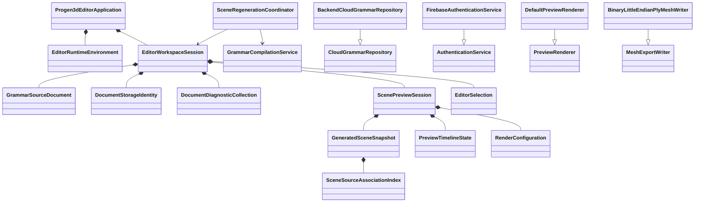

# Progen3D Editor GUI Implementation Plan

## Document Control

- **Project:** ProGen3D
- **Target executable:** `progen3d-editor-gui`
- **Plan date:** August 21, 2026
- **Status:** Proposed implementation sequence
- **Primary technology:** C++17, Dear ImGui, GLFW, OpenGL, GLM
- **Existing verification baseline:** P0, P1, and P2 focused suites

## 1. Objective

Create `progen3d-editor-gui` as a maintainable desktop editor for authoring, validating, previewing, animating, storing, and exporting ProGen3D grammar documents.

The implementation will preserve the existing grammar language, renderer, cloud services, material system, temporal preview behavior, and safety gates while restructuring the GUI around explicit model, service, context, relationship, and presentation classes.

This is an architectural extraction of the current editor prototype, not a rewrite of the grammar engine or OpenGL renderer.

## 2. Current Repository Baseline

### 2.1 Existing Capabilities

The working tree already contains:

- A Dear ImGui application shell using GLFW and OpenGL.
- A grammar source editor with syntax presentation, diagnostics, autocomplete, identifier inspection, and source navigation.
- Asynchronous scene regeneration with queued requests.
- A rendered scene preview with camera interaction, selection outlines, view cube, connection overlays, and fullscreen mode.
- Physics simulation and deterministic grammar-time preview.
- Material parsing, texture previews, cubemap generation, and render controls.
- Firebase authentication and cloud grammar storage.
- Backend file, texture, credit, publishing, and AI APIs.
- AI thread history and grammar-generating responses.
- PLY mesh export.
- STL part-class catalog loading and autocomplete.
- P0 validation and expansion limits.
- P1 semantic isolation and failure atomicity.
- P2 temporal grammar functions and one-clock preview behavior.

### 2.2 Verified Test State

The following command passes in the current working tree:

```bash
./tests/run_p2_checks.sh
```

That command exercises all inherited P0 and P1 checks and the P2 temporal checks. It validates focused runtime contracts but does not prove that the complete GUI links against the repository's production headers.

### 2.3 Immediate Full-Build Failure

The complete application currently fails during `make` because `src/Grammar.cpp` and `include/grammar.h` have incompatible contracts:

1. `GrammarActionToken::var_names` is declared as a C array, while the implementation calls `.size()`.
2. Conditional branch storage is declared on `GrammarConditionalActionToken`, while semantic validation accesses it through `GrammarActionToken`.

The full build must become authoritative before GUI restructuring begins.

### 2.4 Working-Tree Migration State

The repository is in an uncommitted source-layout migration:

- Legacy root-level source files are deleted.
- Replacement files exist under `include/`, `src/`, and `src-old/`.
- Tests, assets, and vendored dependencies are currently untracked.
- Generated build artifacts are present under `build/`.

The first milestone must establish one intentional, reviewable source layout and prevent generated files from becoming part of the implementation baseline.

## 3. Architectural Principles

### 3.1 Object-Model Rules

- Use inheritance only for real conceptual categories.
- Use composition for application ownership and panel assembly.
- Use aggregation for repositories and services supplied to the application.
- Use association classes when connecting grammar source ranges to generated scene objects.
- Keep model classes independent from Dear ImGui.
- Keep OpenGL calls inside rendering classes.
- Keep HTTP and Firebase calls inside service adapters.
- Keep worker-thread ownership inside the regeneration coordinator.
- Give every class one explainable purpose.
- Avoid new generic `Manager`, `Helper`, `Util`, `Base`, or `Processor` classes.

### 3.2 Runtime Invariants

- Grammar validation completes before scene mutation.
- A failed generation never replaces the last valid scene.
- A normal Run selects a new stochastic design seed.
- Time sampling retains the current design seed and changes only grammar time.
- Procedural grammar time and physics simulation are never authoritative simultaneously.
- OpenGL resource creation and destruction occur on the OpenGL-owning thread.
- Remote-service failures never prevent local editing, preview, or export.
- AI-generated grammar remains a proposal until explicitly accepted by the user.

## 4. Target Object Model

### 4.1 Application and Context Classes

#### `Progen3dEditorApplication`

Composition root for the desktop application.

Responsibilities:

- Initialize paths, GLFW, OpenGL, Dear ImGui, fonts, artwork, renderer, and catalogs.
- Own the main frame loop.
- Own startup and shutdown ordering.
- Assemble the workspace, services, repositories, and panels.
- Route application-level shortcuts and shutdown requests.

#### `EditorRuntimeEnvironment`

Owns runtime objects that live for the duration of the application.

Composed objects:

- `GlfwApplicationWindow`
- `ImGuiRuntimeContext`
- `PreviewRenderer`
- `ApplicationPathLocator`
- `PartCatalogRepository`

#### `EditorWorkspaceSession`

Represents one open editing workspace.

Composed objects:

- `GrammarSourceDocument`
- `DocumentStorageIdentity`
- `DocumentDiagnosticCollection`
- `ScenePreviewSession`
- `EditorSelection`
- `WorkspaceLayoutState`
- `AiAssistantSession`
- `AuthenticatedUserSession`

The first implementation supports one workspace session. Multi-document tabs can be added later by aggregating multiple `EditorWorkspaceSession` instances.

### 4.2 Model Classes

#### `GrammarSourceDocument`

Owns:

- Grammar source text.
- Dirty state.
- Document title.
- Local path when present.
- Stochastic design nonce.
- Last successful generation request identity.

It does not own cloud transport, rendering, authentication, or Dear ImGui state.

#### `DocumentStorageIdentity`

Owns:

- Cloud file ID.
- Cloud title.
- Publication state.
- Last known remote update time.

This keeps local document identity separate from cloud identity.

#### `DocumentDiagnosticCollection`

Owns parser, semantic, generation, and editor diagnostics with source ranges and severity.

It replaces parallel collections such as `grammar_error_lines` and `grammar_error_details`.

#### `SceneGenerationRequest`

Immutable request containing:

- Source text.
- Design seed.
- Evaluation time.
- Request sequence number.
- Whether the request is a normal generation or a temporal sample.
- Whether success logging should be quiet.

#### `SceneGenerationResult`

Owns either:

- A complete `GeneratedSceneSnapshot`, or
- Blocking diagnostics and an error description.

#### `GeneratedSceneSnapshot`

Owns the successful generation artifacts:

- Parsed `GrammarDocument`.
- `SceneGenerationContext`.
- Runtime variable snapshots.
- Material names.
- Evaluation time.
- Design seed.
- Source-to-scene association index.

#### `ScenePreviewSession`

Owns:

- Last valid `GeneratedSceneSnapshot`.
- Preview camera state.
- Preview timeline state.
- Current render configuration.
- Selected and hovered scene identities.

#### `PreviewTimelineState`

Owns:

- Play/pause state.
- Grammar evaluation time.
- Physics simulation time.
- Playback speed.
- Sampling accumulator.
- Active clock type.

#### `RenderConfiguration`

Owns:

- Shadow, anti-aliasing, cubemap, bloom, ambient-occlusion, exposure, and gamma values.
- Texture debug view and mapping override.
- Environment-map generation settings.

#### `WorkspaceLayoutState`

Owns editor/preview/console ratios, fullscreen state, panel visibility, and font scale.

### 4.3 Relationship Classes

#### `SourceRange`

Value object representing start and end line/column positions.

#### `ScenePrimitiveIdentity`

Stable identity for one generated primitive within a scene snapshot.

#### `SceneSourceAssociation`

Associates one `ScenePrimitiveIdentity` with the `SourceRange` responsible for generating it.

#### `SceneSourceAssociationIndex`

Indexes all `SceneSourceAssociation` values for preview-to-editor and editor-to-preview navigation.

#### `EditorSelection`

Owns the selected source range, selected grammar symbol, and selected scene primitive identity without owning either the document or scene.

### 4.4 Service Classes

#### `GrammarCompilationService`

Performs source structure validation, parsing, semantic binding, preflight, expansion, context construction, and scene generation.

It returns a complete `SceneGenerationResult` and does not publish partial state.

#### `SceneRegenerationCoordinator`

Owns:

- Worker thread.
- Pending request.
- Completed result queue.
- Request sequence ordering.
- Auto-run deadline.
- Cancellation and shutdown behavior.

Only this class may replace the workspace's last valid scene snapshot.

#### `DocumentPersistenceService`

Coordinates local save/open behavior and cloud repository calls without owning the document.

#### `CloudGrammarRepository`

Abstract conceptual category for cloud grammar persistence.

Concrete implementation:

- `BackendCloudGrammarRepository`

#### `AuthenticationService`

Abstract conceptual category for authentication.

Concrete implementation:

- `FirebaseAuthenticationService`

#### `TextureLibraryRepository`

Provides texture-slot listing, upload, generation, activation, and preview-image retrieval.

#### `AiGrammarProposalService`

Submits editor context to the backend and returns an `AiGrammarProposal` without modifying the document.

#### `AiGrammarProposalReview`

Owns proposed grammar, calculated source differences, warnings, and acceptance state.

#### `MeshExportService`

Builds an export request from the last valid scene and delegates encoding to `MeshExportWriter` implementations.

### 4.5 Presentation Classes

The presentation layer uses composition. It does not require an artificial common panel base class.

- `ApplicationHeaderPanel`
- `GrammarEditorPanel`
- `GrammarSymbolInspectorPanel`
- `ScenePreviewPanel`
- `PreviewTimelinePanel`
- `SceneInspectorPanel`
- `DiagnosticsPanel`
- `ConsolePanel`
- `MaterialLibraryPanel`
- `RenderSettingsPanel`
- `CloudDocumentDialog`
- `AuthenticationPanel`
- `AiAssistantPanel`
- `AiGrammarProposalPanel`

Each panel receives only the models, services, and commands it needs.

### 4.6 Relationship Diagram



## 5. Proposed Source Layout

```text
include/
  editor/
    application/
      Progen3dEditorApplication.h
      EditorRuntimeEnvironment.h
    model/
      GrammarSourceDocument.h
      DocumentStorageIdentity.h
      DocumentDiagnosticCollection.h
      SceneGenerationRequest.h
      SceneGenerationResult.h
      GeneratedSceneSnapshot.h
      ScenePreviewSession.h
      PreviewTimelineState.h
      RenderConfiguration.h
      WorkspaceLayoutState.h
      EditorSelection.h
    relationship/
      SourceRange.h
      ScenePrimitiveIdentity.h
      SceneSourceAssociation.h
      SceneSourceAssociationIndex.h
    service/
      GrammarCompilationService.h
      SceneRegenerationCoordinator.h
      DocumentPersistenceService.h
      CloudGrammarRepository.h
      BackendCloudGrammarRepository.h
      AuthenticationService.h
      FirebaseAuthenticationService.h
      TextureLibraryRepository.h
      AiGrammarProposalService.h
      MeshExportService.h
    presentation/
      ApplicationHeaderPanel.h
      GrammarEditorPanel.h
      GrammarSymbolInspectorPanel.h
      ScenePreviewPanel.h
      PreviewTimelinePanel.h
      SceneInspectorPanel.h
      DiagnosticsPanel.h
      ConsolePanel.h
      MaterialLibraryPanel.h
      RenderSettingsPanel.h
      CloudDocumentDialog.h
      AuthenticationPanel.h
      AiAssistantPanel.h
      AiGrammarProposalPanel.h

src/
  editor/
    application/
    model/
    relationship/
    service/
    presentation/
  main.cpp

  Grammar.cpp
  Context.cpp
  Scope.cpp
  Mesh.cpp
  Solution.cpp
  StlCatalog.cpp
  imgui_render.cpp
  BackendApiClient.cpp
  FirebaseAuth.cpp
  FirebaseStorage.cpp
```

Existing grammar and scene-runtime files remain in place during extraction. They should only move after their public contracts are stable and the full build is continuously verified.

## 6. Implementation Milestones

## Milestone 0: Restore the Authoritative Build

### Goal

Make the complete application build and establish a clean migration baseline before architectural changes.

### Tasks

1. Reconcile `include/grammar.h` with `src/Grammar.cpp`.
   - Replace `GrammarActionToken::var_names` with `std::array<std::string, 3>` or remove implementation assumptions that require container methods.
   - Use `getTrueBranchTokens()` and `getFalseBranchTokens()` when reading conditional branches through a base token pointer.
   - Verify cloning and destruction of conditional tokens.
2. Perform a clean full build.
3. Run `./tests/run_p2_checks.sh` after the full build.
4. Decide which root-level deletions and `src-old/` files belong in the migration.
5. Ensure `.gitignore` excludes build objects, generated executables, test harness outputs, and temporary logs.
6. Make `progen3d-editor-gui` the primary target while temporarily retaining `progen3d` as a compatibility target if needed.
7. Document the supported build command and dependency assumptions.

### Acceptance Gates

- `make clean` succeeds.
- `make progen3d-editor-gui` succeeds from a clean tree.
- `./tests/run_p2_checks.sh` passes.
- No stale object file is required for linking.
- No generated binary or object is treated as source evidence.
- The intentional source migration is visible through a reviewable Git diff.

## Milestone 1: Introduce the Application Composition Root

### Goal

Move lifecycle ownership out of procedural `main()` logic without changing visible behavior.

### Tasks

1. Add `src/main.cpp` containing only argument handling and `Progen3dEditorApplication::run()`.
2. Create `Progen3dEditorApplication`.
3. Create `EditorRuntimeEnvironment`.
4. Move path initialization, GLFW setup, OpenGL loading, ImGui setup, font loading, catalog loading, and renderer startup into explicit methods.
5. Represent startup stages as `ApplicationStartupStage` values rather than repeated procedural blocks.
6. Move shutdown ordering into deterministic destructors or explicit shutdown methods.
7. Preserve the existing startup loader presentation.

### Acceptance Gates

- Application startup behavior remains visually equivalent.
- Initialization failure reports which subsystem failed.
- Shutdown joins the regeneration worker before destroying grammar or rendering state.
- OpenGL resources are destroyed before the window and context.
- `main()` contains no editor behavior.

## Milestone 2: Establish the Document and Workspace Model

### Goal

Replace the broad `AppState` structure with purpose-specific model and context classes.

### Tasks

1. Create `GrammarSourceDocument`.
2. Create `DocumentStorageIdentity`.
3. Create `DocumentDiagnosticCollection`.
4. Create `WorkspaceLayoutState`.
5. Create `AuthenticatedUserSession` and `AiAssistantSession` as separate models.
6. Create `EditorWorkspaceSession` as the aggregate root for one open workspace.
7. Move New, local Open, local Save, and document-dirty transitions behind `DocumentPersistenceService`.
8. Make local editing available without authentication.
9. Disable cloud, publishing, texture, and AI commands when their services are unavailable instead of hiding the entire workspace.

### Acceptance Gates

- The editor opens in local mode without Firebase configuration.
- New, edit, Run, local Save, local Open, and PLY export work offline.
- Signing in does not replace or reset the current local document.
- Cloud identity is not inferred from the local filename.
- No presentation class directly mutates unrelated workspace state.

## Milestone 3: Extract Compilation and Regeneration

### Goal

Give parsing, generation, worker-thread coordination, and last-valid-scene publication explicit owners.

### Tasks

1. Create `SceneGenerationRequest` and `SceneGenerationResult` value objects.
2. Create `GeneratedSceneSnapshot` with exclusive ownership of successful grammar and context objects.
3. Create `GrammarCompilationService` by extracting the current regeneration-worker body.
4. Create `SceneRegenerationCoordinator`.
5. Move regeneration globals into the coordinator.
6. Replace raw result pointers with `std::unique_ptr` ownership.
7. Add monotonically increasing request sequence numbers.
8. Discard completed results older than the newest requested document revision.
9. Preserve the last valid snapshot after parser, semantic, expansion, upload, or time-sample failure.
10. Keep normal design generation and temporal sampling as different request types.

### Acceptance Gates

- Editing during generation cannot publish an obsolete scene.
- A failed generation leaves the last valid preview visible.
- A normal Run creates a new design seed.
- A time sample retains the current design seed.
- Worker shutdown cannot access destroyed workspace state.
- Existing P0–P2 checks continue to pass.
- New coordinator tests cover request supersession and failure preservation.

## Milestone 4: Extract the Grammar Editor Presentation

### Goal

Move the grammar editor out of `src/imgui_main.cpp` without changing its established editing behavior.

### Tasks

1. Create `GrammarEditorPanel`.
2. Create `GrammarSyntaxPresentation` for token color and tooltip classification.
3. Create `GrammarAutocompletePresentation` for part and material suggestions.
4. Create `GrammarSymbolIndex` as a document-derived model rather than static global UI state.
5. Move diagnostic underlines and tooltips into `GrammarDiagnosticPresentation`.
6. Move selected-symbol information into `GrammarSymbolInspectorPanel`.
7. Preserve cursor, selection, scroll, Ctrl+wheel zoom, and selection restoration.
8. Keep the two-second auto-run delay in `SceneRegenerationCoordinator`, not inside the panel.
9. Add a diagnostics gutter or compact line marker region.

### Acceptance Gates

- Existing grammar text can be edited without corruption.
- Source selection and caret restoration continue to work.
- Part-class and material autocomplete still work.
- Diagnostics retain line and column precision.
- Selecting a diagnostic navigates to its source range.
- `GrammarEditorPanel` does not call backend or OpenGL APIs.

## Milestone 5: Extract Preview, Timeline, and Selection

### Goal

Separate preview presentation, camera interaction, temporal control, and source-scene relationships.

### Tasks

1. Create `ScenePreviewSession`.
2. Create `PreviewTimelineState` and `PreviewTimelineController`.
3. Create `PreviewCameraController`.
4. Create `SceneSelectionController`.
5. Create `SceneSourceAssociationIndex` from generated primitive source ranges.
6. Move `draw_preview()` into `ScenePreviewPanel`.
7. Move view-cube behavior into `PreviewOrientationControl`.
8. Move overlay settings into `SceneOverlayConfiguration`.
9. Move render settings into `RenderConfiguration` and `RenderSettingsPanel`.
10. Keep `PreviewRenderer` as the rendering abstraction and rename its concrete implementation to `OpenGlPreviewRenderer` when practical.

### Acceptance Gates

- Preview orbit, pan, zoom, fit, view cube, and fullscreen behavior remain functional.
- Hovered and selected objects retain distinct outlines.
- Clicking a primitive selects its generating source range.
- Grammar-time scenes show grammar time and do not advance physics.
- Physics scenes advance simulation and do not request grammar-time snapshots.
- Step and Reset operate on the currently authoritative clock only.
- A failed time sample preserves the last valid preview.

## Milestone 6: Extract Diagnostics, Console, and Inspector Panels

### Goal

Present runtime evidence through explicit, navigable panels.

### Tasks

1. Create `DiagnosticsPanel` with severity filters and source navigation.
2. Create `ConsolePanel` backed by a bounded `ApplicationLog` model.
3. Create `SceneInspectorPanel` for the selected primitive.
4. Show primitive type, material, bounds, transform, mass, density, velocity, source range, and connection evidence where available.
5. Create `PreviewStatistics` for rule, token, primitive, material, generation-time, and render-time metrics.
6. Keep parser diagnostics separate from operational backend errors.

### Acceptance Gates

- Diagnostic selection navigates to source.
- Runtime and backend errors do not appear as grammar syntax errors.
- Scene inspection reads from the current immutable scene snapshot.
- The log remains bounded during long preview sessions.

## Milestone 7: Adapt Cloud, Texture, AI, and Export Workflows

### Goal

Move remote and export behavior out of panels and make every workflow explicit and failure-isolated.

### Tasks

1. Implement `BackendCloudGrammarRepository` using the existing backend API client.
2. Implement `FirebaseAuthenticationService` using the existing authentication functions.
3. Move cloud Open, Save As, Save, and Publish behavior into `DocumentPersistenceService`.
4. Create `TextureLibraryRepository` and preserve the 20-slot contract.
5. Create `AiGrammarProposalService`.
6. Replace direct Apply Grammar behavior with `AiGrammarProposalReview`.
7. Show source differences before AI grammar is accepted.
8. Support Accept Full Proposal, Accept Selected Changes, and Reject Proposal.
9. Keep existing PLY export through `MeshExportService`.
10. Treat additional export formats as separate `MeshExportWriter` subclasses only when their format contracts are defined.

### Acceptance Gates

- Local editor behavior remains available while signed out.
- Remote failures produce actionable status without clearing the document.
- Save and Publish are separate operations.
- AI output cannot mutate the document without an explicit acceptance action.
- Accepted AI changes mark the document dirty and trigger normal validation.
- Export always uses the last valid scene, never a failed partial generation.

## Milestone 8: Verification, CI, and Release Readiness

### Goal

Make the complete editor, not only focused harnesses, continuously verifiable.

### Tasks

1. Add a deterministic application smoke-test mode.
2. Add a headless startup test using Xvfb when available.
3. Add a startup option that loads `examples/P2_time_showcase.p3d`.
4. Verify initial scene generation and one rendered frame.
5. Add integration tests for local document lifecycle.
6. Add regeneration-coordinator concurrency tests.
7. Add service contract fakes for authentication, cloud files, textures, and AI proposals.
8. Add compiler warnings for application sources.
9. Restore CI only after it builds the current source layout and runs the same authoritative commands used locally.
10. Restore packaging after the executable name, resources, and runtime paths are stable.

### Acceptance Gates

- Clean full build passes on the supported Linux environment.
- P0, P1, and P2 suites pass.
- Headless editor startup reaches a generated preview.
- Offline editing smoke test passes.
- Temporal preview smoke test passes.
- Cloud and AI contract tests pass without live credentials.
- No release artifact relies on stale build objects.

## 7. Current-to-Target Responsibility Map

| Current state or function | Target owner |
|---|---|
| Global `Grammar *grammar` | `GeneratedSceneSnapshot` |
| Global regeneration worker and pending flags | `SceneRegenerationCoordinator` |
| `AppState::editor_text` | `GrammarSourceDocument` |
| `AppState::editor_dirty` | `GrammarSourceDocument` |
| Cloud ID, title, and publication flags | `DocumentStorageIdentity` |
| Grammar error line/detail vectors | `DocumentDiagnosticCollection` |
| Workspace split ratios and fullscreen flag | `WorkspaceLayoutState` |
| Render-setting fields | `RenderConfiguration` |
| Global play and animation-time values | `PreviewTimelineState` |
| Hovered and selected instance indices | `EditorSelection` and `ScenePrimitiveIdentity` |
| Primitive source line and column metadata | `SceneSourceAssociationIndex` |
| `draw_main_layout()` | `EditorWorkspaceWindow` |
| `draw_editor()` | `GrammarEditorPanel` plus document command controls |
| `draw_smart_editor()` | `GrammarEditorPanel` |
| `draw_preview()` | `ScenePreviewPanel` and preview controllers |
| `draw_console()` | `ConsolePanel` |
| `draw_material_controls()` | `MaterialLibraryPanel` |
| `draw_render_settings_controls()` | `RenderSettingsPanel` |
| `draw_ai_controls()` | `AiAssistantPanel` and `AiGrammarProposalPanel` |
| Cloud modal functions | `CloudDocumentDialog` and `DocumentPersistenceService` |
| Firebase login drawing | `AuthenticationPanel` |
| Direct PLY action | `MeshExportService` |

## 8. Recommended Change Sequence

The implementation should remain runnable after every milestone. The recommended review sequence is:

1. **Build Contract Repair**
   - Header/source reconciliation.
   - Clean full build.
   - P0–P2 verification.

2. **Application Shell Extraction**
   - New executable target.
   - Composition root.
   - Startup and shutdown ownership.

3. **Workspace and Document Models**
   - Decompose `AppState` without changing visual behavior.
   - Enable offline workspace access.

4. **Regeneration Ownership**
   - Request/result objects.
   - Worker coordinator.
   - Last-valid-scene invariant.

5. **Editor Panel Extraction**
   - Syntax, diagnostics, autocomplete, and symbol navigation.

6. **Preview Panel Extraction**
   - Camera, timeline, selection, overlays, and rendering configuration.

7. **Remote-Service Adapters**
   - Authentication, cloud files, textures, and AI proposals.

8. **Complete-Application Verification**
   - Headless startup, smoke tests, CI, and packaging.

Do not combine the build repair, state-model rewrite, renderer changes, and backend workflow rewrite into one change set. Their failure modes are different and should remain independently reviewable.

## 9. Verification Matrix

| Area | Required verification |
|---|---|
| Grammar safety | Existing P0 checks |
| Semantic isolation | Existing P1 checks |
| Temporal behavior | Existing P2 checks |
| Full compilation | Clean `make progen3d-editor-gui` |
| Startup | Headless application smoke test |
| Document lifecycle | New, edit, save, open, dirty-state integration tests |
| Regeneration | Request supersession, last-valid preservation, shutdown tests |
| Preview clock | Grammar-time versus physics-time integration tests |
| Selection | Preview-to-source and source-to-preview tests |
| Rendering | Initial frame, resize, fullscreen, and resource shutdown smoke tests |
| Cloud | Repository contract tests with fake responses |
| Authentication | Signed-out local mode and fake-session tests |
| AI | Proposal review and explicit-acceptance tests |
| Export | PLY export from the last valid scene |

## 10. Primary Risks and Mitigations

### Risk: Focused tests mask production-header drift

**Mitigation:** Make the clean full application build the first gate, then run focused tests.

### Risk: Procedural globals hide ownership dependencies

**Mitigation:** Move one responsibility at a time into explicit session or service classes while retaining behavior.

### Risk: OpenGL resources cross worker-thread boundaries

**Mitigation:** Worker threads produce CPU-side scene data. The application thread performs GPU uploads and resource destruction.

### Risk: Obsolete regeneration results replace newer edits

**Mitigation:** Assign monotonic request sequence numbers and publish only the newest applicable result.

### Risk: Authentication blocks the core editor

**Mitigation:** Treat authentication as an optional capability and keep the local workspace always available.

### Risk: AI changes bypass deterministic validation

**Mitigation:** Stage AI output as a proposal, require explicit acceptance, then run it through the normal document and generation pipeline.

### Risk: Source-layout migration obscures actual changes

**Mitigation:** Finish or intentionally revert the migration before broad GUI extraction and exclude generated files.

### Risk: Large visual changes hide architectural regressions

**Mitigation:** Preserve current visual behavior through Milestones 1–5. Perform visual redesign only after ownership and tests are stable.

## 11. Deferred Work

The following work is intentionally outside the first implementation sequence:

- Rewriting the grammar syntax.
- Replacing Dear ImGui with Qt or another toolkit.
- Replacing OpenGL with Vulkan or another renderer.
- Multi-document tabs.
- Collaborative live editing.
- New mesh export formats without defined contracts.
- Remote rendering.
- Plugin scripting.
- Major backend API redesign.
- Packaging changes before the executable and resource layout are stable.

## 12. Completion Standard

`progen3d-editor-gui` is complete when:

- The repository builds the complete GUI from a clean checkout.
- The P0, P1, and P2 suites pass unchanged or with explicitly reviewed extensions.
- Local editing, validation, preview, animation, selection, and PLY export work without authentication.
- Cloud, texture, publishing, and AI capabilities activate after authentication without owning core editor state.
- Invalid grammars cannot mutate or replace the last valid scene.
- Grammar time and physics time remain mutually exclusive authorities.
- AI-generated grammar is reviewable before application.
- Application, document, regeneration, preview, persistence, and presentation responsibilities are represented by purpose-named classes.
- The relationships between the classes can be translated into a UML diagram without guessing.
- The former `src/imgui_main.cpp` procedural responsibilities have been reduced to explicit application and presentation components.

## 13. First Implementation Slice

The first implementation slice should contain only:

1. Reconcile `include/grammar.h` with `src/Grammar.cpp`.
2. Add the `progen3d-editor-gui` build target.
3. Produce a clean linked executable without stale objects.
4. Run `./tests/run_p2_checks.sh`.
5. Add a minimal full-application startup smoke check.

No GUI restructuring should begin until those five items pass together.
