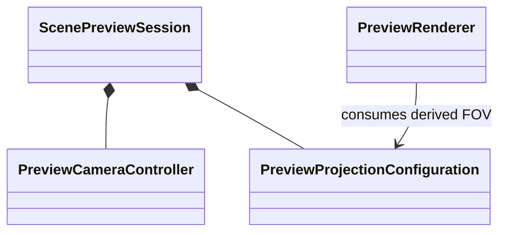

# ProGen3D Preview FOV Slider Implementation Plan

## Document Control

- **Project:** ProGen3D Editor GUI
- **Target executable:** `progen3d-editor-gui`
- **Plan date:** August 21, 2026
- **Status:** Proposed implementation sequence
- **Feature:** Adjustable vertical field of view for the preview canvas
- **Primary technology:** C++17, Dear ImGui, GLM, OpenGL
- **Authoritative verification command:** `./tests/run_release_checks.sh`

## 1. Objective

Add an adjustable vertical field-of-view control to the preview camera without changing grammar source, generated scene state, temporal authority, selection semantics, or document dirty state.

The feature must establish one explicit projection configuration used by:

- Preview rendering.
- Preview object picking.
- Camera fit-to-bounds calculations.
- Camera reset behavior.
- The preview camera controls presented by Dear ImGui.

The implementation must first correct the existing degree-versus-radian inconsistency before exposing the value to users.

## 2. Current Repository Evidence

### 2.1 Existing Camera State

`PreviewCameraController` currently owns:

- Scene scale.
- Orbit azimuth and elevation.
- Camera target.
- Camera distance.
- Orbit, pan, wheel zoom, orientation, reset, and fit-to-bounds behavior.

It does not own or receive a configurable FOV.

Relevant files:

- `include/editor/controller/PreviewCameraController.h`
- `src/editor/controller/PreviewCameraController.cpp`
- `include/editor/model/ScenePreviewSession.h`

### 2.2 Fixed Projection Values

The nominal value `43.0` exists in three projection-related paths:

1. `PreviewCameraController::fitToBounds()` treats it as degrees and converts it to radians.
2. `build_preview_camera_state()` passes it directly to `glm::perspective()` for picking.
3. `build_camera_matrices()` passes it directly to `glm::perspective()` for rendering.

The installed GLM implementation expects radians. The fitting path therefore assumes a 43-degree lens while the picking and rendering paths consume the numeric value as radians.

This inconsistency must be fixed before adding the slider.

### 2.3 Existing Preview UI

The preview toolbar currently contains:

- Play or Pause.
- Step.
- Reset Time or Reset Simulation.
- Reset View.
- Fit.
- Run.
- Full Screen or Windowed.
- Playback speed.
- Grammar time or simulation time.
- Camera-distance status.
- Overlay controls.

A permanently expanded FOV slider would overcrowd this row. The control should therefore use a compact camera button and popup.

## 3. Product Decisions

### 3.1 FOV Meaning

- The value is **vertical perspective field of view in degrees**.
- The default value is **43 degrees**.
- The supported range is **15 through 100 degrees**.
- Lower values produce a telephoto-like, flatter view.
- Higher values produce a wider, more perspective-exaggerated view.

### 3.2 Camera Interaction

- Mouse-wheel zoom continues to change camera distance.
- Dragging the FOV slider changes only the lens angle.
- Changing FOV does not automatically move the camera.
- `Fit` preserves the selected FOV and calculates a matching distance.
- `Reset View` restores camera pose, distance, target, scale, and the default 43-degree FOV.
- FOV changes take effect immediately without grammar regeneration.

### 3.3 Persistence

- FOV is preview-session state, not grammar-document content.
- Changing FOV must not mark `GrammarSourceDocument` dirty.
- The first implementation does not persist FOV across application launches.
- Future workspace-preference persistence may store it without changing grammar files.

### 3.4 Deferred Projection Modes

Orthographic projection is explicitly deferred. The FOV implementation should not introduce a partially implemented projection-mode enum or inactive orthographic fields.

## 4. Target Object Model

### 4.1 `PreviewProjectionConfiguration`

Create a model class dedicated to preview projection state.

Proposed file:

- `include/editor/model/PreviewProjectionConfiguration.h`
- `src/editor/model/PreviewProjectionConfiguration.cpp`

Responsibilities:

- Own vertical FOV in degrees.
- Clamp requested values to the supported range.
- Provide the value in degrees for presentation.
- Provide an explicitly named radians value for GLM.
- Restore the default projection configuration.

Proposed public contract:

```cpp
class PreviewProjectionConfiguration
{
public:
    static constexpr float minimum_vertical_field_of_view_degrees = 15.0f;
    static constexpr float default_vertical_field_of_view_degrees = 43.0f;
    static constexpr float maximum_vertical_field_of_view_degrees = 100.0f;

    float verticalFieldOfViewDegrees() const;
    float verticalFieldOfViewRadians() const;

    void setVerticalFieldOfViewDegrees(float requested_degrees);
    void reset();

private:
    float vertical_field_of_view_degrees_ =
        default_vertical_field_of_view_degrees;
};
```

The class name and methods make the measurement unit explicit and prevent another degree-versus-radian ambiguity.

### 4.2 `ScenePreviewSession`

Compose the new model beside the existing camera controller:

```cpp
PreviewCameraController camera;
PreviewProjectionConfiguration projection;
```

Relationship:



### 4.3 `PreviewCameraController`

Extend `fitToBounds()` so its calculation uses the active projection configuration rather than a private fixed constant.

Preferred contract:

```cpp
void fitToBounds(float center_x,
                 float center_y,
                 float center_z,
                 float half_extent_x,
                 float half_extent_y,
                 float half_extent_z,
                 float viewport_width,
                 float viewport_height,
                 const PreviewProjectionConfiguration &projection);
```

Add a reset overload or coordinated session-level reset command so the existing camera reset and projection reset occur together. Do not make the camera controller own document, rendering, or Dear ImGui responsibilities.

### 4.4 Renderer Camera Contract

Extend `PreviewCameraState` with an explicitly unit-named value:

```cpp
float vertical_field_of_view_radians = glm::radians(43.0f);
```

The renderer must not infer units or contain another hardcoded 43 value.

## 5. Presentation Design

### 5.1 Toolbar Entry

Replace the passive camera-distance chip with a compact button such as:

```text
Camera 43 deg / 5.00
```

Clicking the button opens `PreviewCameraOptions`.

The button should remain in `PreviewTimelinePanel` because it controls the active preview viewport rather than post-processing quality.

### 5.2 Camera Popup

The popup contains:

1. Heading: `Camera Lens`.
2. Explanatory text describing narrow and wide FOV.
3. `ImGui::SliderFloat` from 15 to 100 degrees.
4. Preset buttons:
   - `24 deg Telephoto`
   - `43 deg Standard`
   - `70 deg Wide`
5. `Reset Lens` button.
6. Current camera-distance readout.

Proposed slider behavior:

```cpp
float editable_fov = projection.verticalFieldOfViewDegrees();
if (ImGui::SliderFloat("Vertical FOV",
                       &editable_fov,
                       PreviewProjectionConfiguration::minimum_vertical_field_of_view_degrees,
                       PreviewProjectionConfiguration::maximum_vertical_field_of_view_degrees,
                       "%.0f deg",
                       ImGuiSliderFlags_AlwaysClamp)) {
    projection.setVerticalFieldOfViewDegrees(editable_fov);
}
```

The popup may request a preview redraw, but it must not call grammar regeneration.

### 5.3 Accessibility and Feedback

- The slider must support keyboard navigation through normal Dear ImGui behavior.
- Hovering the control should explain that mouse-wheel zoom changes distance instead.
- The toolbar button must display the effective clamped value.
- Presets must use the same setter as the slider.

## 6. Implementation Milestones

## Milestone 0: Capture the Current Baseline

### Tasks

1. Run `./tests/run_preview_session_checks.sh`.
2. Run `./tests/run_gui_smoke_check.sh`.
3. Confirm the supervised GUI process state before rebuilding.
4. Record that existing rendering and picking both use the same hardcoded numeric value, while fit-to-bounds converts degrees.

### Acceptance Gates

- Preview controller checks pass.
- GUI smoke check reaches a rendered frame.
- No source changes are made during baseline capture.

## Milestone 1: Correct Projection Units

### Tasks

1. Replace both direct `43.0` perspective arguments with explicit radians conversion.
2. Keep the visible default equivalent to an actual 43-degree vertical FOV.
3. Verify rendering, picking, selection, view-cube interaction, and Fit behavior.
4. Add a source gate preventing a bare degree value from being passed to `glm::perspective()`.

### Acceptance Gates

- Both GLM projection calls receive radians.
- Picking remains aligned with rendered primitives.
- Fit-to-bounds frames the scene using the corrected projection.
- The ordinary GUI smoke test passes.

## Milestone 2: Add Projection State

### Tasks

1. Implement `PreviewProjectionConfiguration`.
2. Compose it into `ScenePreviewSession`.
3. Add the new source file to `Makefile`.
4. Remove the private FOV constant from `PreviewCameraController.cpp`.
5. Make camera fitting consume the projection model.
6. Make reset behavior restore the projection default.

### Acceptance Gates

- FOV has one authoritative model owner.
- Requested values clamp to 15 through 100 degrees.
- The default is exactly 43 degrees.
- Camera fitting has no hardcoded FOV.

## Milestone 3: Unify Rendering and Picking Inputs

### Tasks

1. Add `vertical_field_of_view_radians` to `PreviewCameraState`.
2. Populate it from `PreviewProjectionConfiguration`.
3. Pass it through `render_scene_to_preview()` or replace the long camera argument list with a complete `PreviewCameraState` value.
4. Make `build_preview_camera_state()` use the same projection configuration for picking.
5. Remove the remaining hardcoded preview FOV values.

Preferred incremental design:

- Construct one complete `PreviewCameraState` in the preview presentation path.
- Supply that state to the renderer.
- Construct the interaction projection from the same session configuration.
- Avoid adding new process-global FOV references.

### Acceptance Gates

- Rendering and picking consume the same effective FOV.
- Projection units are explicit at every API boundary.
- The renderer does not access `EditorWorkspaceSession` directly.
- Changing FOV does not request scene regeneration.

## Milestone 4: Add the FOV Slider

### Tasks

1. Convert the camera status chip into a popup-opening camera control.
2. Add the vertical FOV slider.
3. Add telephoto, standard, and wide presets.
4. Add Reset Lens.
5. Update Reset View to restore the complete default camera view.
6. Keep Fit based on the current FOV.
7. Ensure the popup remains usable in narrow and fullscreen preview layouts.

### Acceptance Gates

- Slider changes are visible in the next rendered frame.
- No grammar request is queued while moving the slider.
- No document dirty flag changes.
- The displayed value matches the effective clamped value.
- Reset and presets are deterministic.

## Milestone 5: Verification and Supervised Restart

### Tasks

1. Extend `tests/preview_session_harness.cpp` for projection defaults, clamping, reset, and fitting.
2. Add projection-matrix checks for narrow, standard, and wide FOV values.
3. Add a source gate confirming that renderer and interaction paths use the projection model.
4. Run the focused preview suite.
5. Run the complete release suite.
6. Restart `progen3d-editor-gui.service` only after all checks pass.
7. Verify the service PID, restart count, and recent logs.

### Acceptance Gates

- `./tests/run_preview_session_checks.sh` passes.
- `./tests/run_editor_architecture_checks.sh` passes.
- `./tests/run_release_checks.sh` passes from a clean application build.
- Both GUI smoke modes pass.
- The supervised GUI remains `active (running)` after restart.

## 7. File Change Map

### New Files

- `include/editor/model/PreviewProjectionConfiguration.h`
- `src/editor/model/PreviewProjectionConfiguration.cpp`

### Modified Model and Controller Files

- `include/editor/model/ScenePreviewSession.h`
- `include/editor/controller/PreviewCameraController.h`
- `src/editor/controller/PreviewCameraController.cpp`

### Modified Rendering Files

- `include/imgui_render.h`
- `src/imgui_render.cpp`
- `src/imgui_main.cpp`

### Modified Build and Test Files

- `Makefile`
- `tests/preview_session_harness.cpp`
- `tests/run_preview_session_checks.sh`
- `tests/test_p2_time.py` only if its exact source gates need updating after signature changes
- `tests/README.md`

## 8. Verification Matrix

| Area | Verification |
|---|---|
| Projection default | New configuration starts at exactly 43 degrees |
| Input bounds | Values below 15 and above 100 clamp safely |
| Unit correctness | GLM receives radians through explicitly named APIs |
| Fit behavior | Wider FOV produces a nearer fitted distance for identical bounds |
| Rendering | Narrow, standard, and wide matrices are finite and non-degenerate |
| Picking | Selection projection uses the same effective FOV as rendering |
| Reset | Reset View restores 43 degrees and the default camera pose |
| Presets | 24, 43, and 70-degree actions use the model setter |
| Document isolation | Slider changes never mark grammar source dirty |
| Regeneration isolation | Slider changes never enqueue grammar compilation |
| Temporal behavior | Grammar-time and physics-time tests remain unchanged |
| Full application | Ordinary and temporal Xvfb smoke tests pass |

## 9. Risks and Mitigations

### Risk: Rendering and Picking Drift Apart

**Mitigation:** Feed both paths from `PreviewProjectionConfiguration` and test the effective projection input at narrow, default, and wide settings.

### Risk: Degree and Radian Confusion Returns

**Mitigation:** Include the unit in every relevant method and field name. Convert degrees to radians only through `verticalFieldOfViewRadians()`.

### Risk: Extreme FOV Values Produce Unusable Views

**Mitigation:** Clamp values to 15 through 100 degrees and keep presets within common modeling ranges.

### Risk: Fit-to-Bounds Ignores the Active Lens

**Mitigation:** Require the projection configuration in the fit method and add monotonic-distance tests.

### Risk: Slider Movement Triggers Expensive Scene Work

**Mitigation:** Treat FOV as camera-only state. Do not set document dirty state, regeneration flags, or render-material invalidation flags.

### Risk: Toolbar Becomes Overcrowded

**Mitigation:** Use one compact camera button and a popup rather than an always-visible slider.

### Risk: Correcting the Existing Projection Changes the Visual Baseline

**Mitigation:** Land and verify the radians correction before the adjustable-state and UI changes. Review screenshots or the live GUI after each slice.

## 10. Explicit Non-Goals

- Orthographic projection.
- Physical camera focal-length or sensor-size simulation.
- Depth-of-field rendering.
- Animated FOV in grammar time.
- Saving FOV inside `.p3d` grammar documents.
- Changing the existing mouse-wheel zoom convention.
- Regenerating geometry when camera projection changes.

## 11. Completion Standard

The adjustable FOV feature is complete when:

- The preview presents a discoverable vertical FOV control.
- The effective default is an actual 43-degree vertical field of view.
- FOV is owned by a purpose-named preview model.
- Rendering, picking, and Fit use the same projection configuration.
- Reset and preset actions behave deterministically.
- Camera-only changes do not affect grammar or scene-generation state.
- The focused preview tests and complete release checks pass.
- The supervised GUI restarts successfully and displays the feature without runtime errors.

## 12. Recommended Review Sequence

1. Projection-unit correction and regression tests.
2. `PreviewProjectionConfiguration` model and session composition.
3. Camera fitting and renderer/picking plumbing.
4. Dear ImGui camera popup and presets.
5. Full release verification and supervised GUI restart.

Each review slice should leave `progen3d-editor-gui` buildable and runnable.
