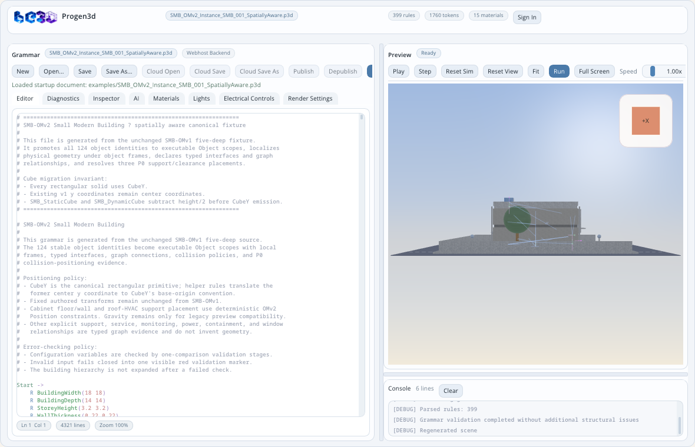
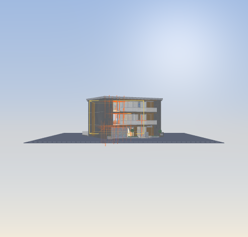
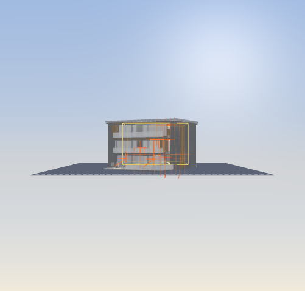
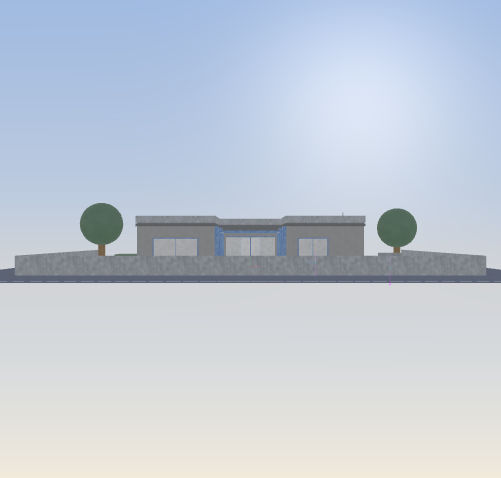
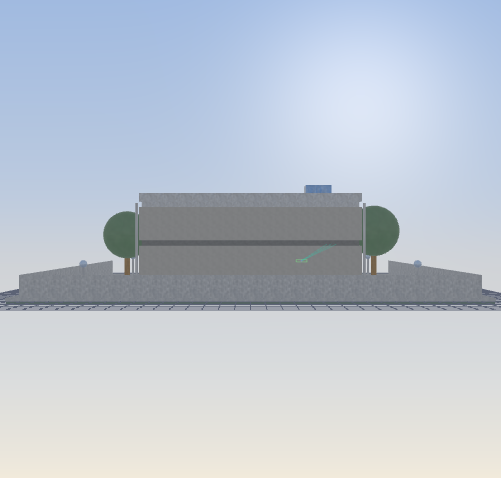

# ProGen3D

ProGen3D is a Linux desktop editor and runtime for procedural 3D grammars. It combines a source editor, structural diagnostics, deterministic scene regeneration, an interactive OpenGL preview, physically based materials, authored lighting and electrical controls, spatial object inspection, collision-aware placement, and evidence-oriented validation.

The repository includes examples ranging from a single cube to spatially aware modern buildings, a 20-level architectural taxonomy, chairs, vehicles, vegetation, temporal geometry, and advanced procedural primitives.



## Contents

- [Quick start](#quick-start)
- [Screenshot walkthrough](#screenshot-walkthrough)
- [Complete GUI reference](#complete-gui-reference)
- [Grammar primer](#grammar-primer)
- [Modern Buildings](#modern-buildings)
- [Building validation workflow](#building-validation-workflow)
- [Command-line reference](#command-line-reference)
- [Repository guide](#repository-guide)
- [Verification](#verification)

## Quick start

### Supported desktop baseline

- Linux
- C++17
- GNU Make
- Dear ImGui 1.90.1
- GLFW and OpenGL
- GLM
- libcurl with OpenSSL
- D-Bus and the XDG Desktop Portal file chooser

The expected third-party source layout is under `third_party/`. Native File Dialog Extended uses the XDG portal backend on Linux.

### Build

```bash
make clean
make -j2 all
```

The complete build produces the editor, compatibility link, textured-mesh
converter, and orthographic three-view converter:

```text
./progen3d-editor-gui
./progen3d
./p3d_to_3dtexmesh
./p3d_to_3view
```

Run the editor:

```bash
./progen3d-editor-gui
```

The compatibility target creates the `progen3d` symbolic link:

```bash
make progen3d
./progen3d
```

Create the deterministic Linux binary bundle and its SHA-256 file with:

```bash
make package
./tests/run_conversion_package_checks.sh
```

The archive is written to
`build/packages/progen3d-linux-x86_64.tar.gz`.

See [BUILDING.md](BUILDING.md) for the complete build, clean-state, and dependency notes.

### Open a modern building

Open the spatially aware Small Modern Building with its evidence overlays enabled:

```bash
./progen3d-editor-gui \
  --spatial-overlays \
  --open examples/SMB_OMv2_Instance_SMB_001_SpatiallyAware.p3d
```

Open the 20-level courtyard building:

```bash
./progen3d-editor-gui \
  --spatial-overlays \
  --open examples/Complex_Modern_Courtyard_Building_OM20/Complex_Modern_Courtyard_Building_OM20.p3d
```

## Screenshot walkthrough

The main window is deliberately arranged as a three-part authoring workspace: grammar source on the left, a live preview on the upper right, and generation/runtime messages on the lower right.

<p align="center">
  <a href="docs/images/readme/progen3d-editor-smb-omv2-full.png">
    
  </a>
</p>

The screenshot is a complete desktop session, not a preview-only render. Open it at full size and read the interface from top to bottom:

| Region | Where it appears | What it owns |
|---|---|---|
| 1. Application header | Full-width top strip | Current document identity, rule/token/material counts, authentication state, role, and credits. |
| 2. Grammar document toolbar | Upper-left toolbar | New/Open/Save, cloud lifecycle, publishing, immediate regeneration, and PLY export. |
| 3. Workspace tabs | Below the Grammar toolbar | Editor, Diagnostics, Inspector, AI, Materials, Lights, Electrical Controls, and Render Settings. |
| 4. Active left workspace | Large left pane | The controls and evidence for the selected workspace tab. |
| 5. Editor status row | Bottom of the source editor | Cursor position, source length, zoom, diagnostics, identifier matches, bracket state, and automatic-run countdown. |
| 6. Vertical splitter | Between left and right columns | Changes the relative width of authoring and preview work. |
| 7. Preview header and toolbar | Upper-right header | Playback, stepping, reset, fit, regeneration, full-screen, speed, camera, outline, and overlay controls. |
| 8. Interactive viewport | Main upper-right surface | The last accepted scene snapshot, picking, camera navigation, overlays, light gizmos, and view-cube orientation. |
| 9. View cube | Viewport upper-right | Front/back/left/right/top/bottom orientation selection and current axis feedback. |
| 10. Horizontal splitter | Between Preview and Console | Changes the relative height of visual output and logs. |
| 11. Console header | Lower-right header | Retained line count and log clearing. |
| 12. Console body | Lower-right surface | Parser, validation, regeneration, rendering, capture, backend, and runtime messages. |

### First-session walkthrough

1. Start the editor and choose `Continue Offline` if cloud and AI services are not required.
2. Select `Open...` and load `examples/SMB_OMv2_Instance_SMB_001_SpatiallyAware.p3d`.
3. Wait for the Preview status to return to `Ready`; the Console should report parsed rules, successful validation, and scene regeneration.
4. Drag inside the viewport to orbit the building, scroll to zoom, and use `Fit` if the model leaves the frame.
5. Click a visible primitive, then open `Inspector` to see its immutable primitive snapshot and associated SMB object.
6. Enable `Overlay`, open `Overlay Options`, and select the SMB object frames, interfaces, bounds, connections, constraints, contacts, or clearances needed for the review.
7. Return to `Editor`, make a small source change, and observe the automatic-run countdown in the editor status row.
8. Introduce a temporary syntax error to see Diagnostics and Console reject the candidate while the Preview retains the last valid scene.
9. Correct the error and press `Run` to regenerate immediately.
10. Use `Save As...` before modifying generated examples; regenerate source packages through their generator scripts when the example declares a generated authority.

### 1. Application header

The header identifies the current document and summarizes the active session:

- document name;
- rule count;
- token count;
- material count;
- authenticated role and credit status when a backend session is active;
- `Sign In` or `Sign Out`.

The header is informational. Document commands are grouped in the Grammar workspace immediately below it.

### 2. Grammar document toolbar

The Grammar toolbar owns the local and cloud document lifecycle:

| Control | Purpose |
|---|---|
| `New` | Starts a new grammar after the unsaved-changes guard is resolved. |
| `Open...` | Opens a local `.p3d` or `.grammar` file. Shortcut: `Ctrl+O`. |
| `Save` | Saves to the current local path. Shortcut: `Ctrl+S`. |
| `Save As...` | Saves to a new local path. Shortcut: `Ctrl+Shift+S`. |
| `Cloud Open` | Selects a grammar from authenticated cloud storage. |
| `Cloud Save` | Updates the linked cloud document or asks for a title on first save. |
| `Cloud Save As` | Creates another cloud document from the current source. |
| `Publish` | Publishes the linked cloud document. |
| `Depublish` | Removes the linked document from publication. |
| `Run` | Immediately parses, validates, expands, and regenerates the scene. |
| `Export PLY` | Exports the current generated mesh as a `.ply` file. |

Status chips report `Webhost Backend`, `Cloud linked`, `Modified`, `Published`, `Regenerating`, `Queued update`, or the remaining automatic-run delay.

### 3. Workspace tabs

The tab row changes the left-hand workspace without hiding the preview:

1. `Editor` — source authoring and syntax assistance.
2. `Diagnostics` — navigable parser, semantic, and generation diagnostics.
3. `Inspector` — selected primitive and SMB spatial-object evidence.
4. `AI` — review-controlled assistant conversations and grammar proposals.
5. `Materials` — material vocabulary, PBR previews, and texture-library controls.
6. `Lights` — scene-light presets, authored lights, shadow settings, and evidence.
7. `Electrical Controls` — switches, dimmers, fixtures, and circuits.
8. `Render Settings` — anti-aliasing, textures, shadows, post-processing, environment, and tone mapping.

### 4. Smart grammar editor

The Editor tab provides:

- syntax highlighting for rules, operators, expressions, materials, shapes, and spatial declarations;
- diagnostic underlines and hover messages;
- line and column status;
- matching identifier and bracket feedback;
- autocomplete for part classes, materials, shape options, and spatial declarations;
- automatic regeneration after an edit delay;
- explicit `Run` for immediate regeneration.

The editor preserves the last valid scene when a new source revision fails. The Console and Diagnostics tabs explain why the candidate scene was rejected.

### 5. Preview toolbar

The Preview toolbar controls simulation time, regeneration, framing, and navigation:

| Control | Purpose |
|---|---|
| `Play` / `Pause` | Advances or pauses grammar time or the simulation. |
| `Step` | Advances one deterministic step. |
| `Reset Time` / `Reset Sim` | Resets grammar time or runtime simulation state. |
| `Reset View` | Restores the default camera orientation and distance. |
| `Fit` | Frames all visible generated geometry. |
| `Run` | Regenerates from the current editor source. |
| `Full Screen` | Expands the preview; `F11` provides the same toggle. |
| `Speed` | Scales temporal or simulation playback. |
| Camera control | Opens field-of-view and camera-motion settings. |
| `Overlay` | Enables the selected inspection overlays. |
| `Outline` | Draws selection and evidence outlines. |
| `Overlay Options` | Configures connection, profile, spatial, knowledge, and texture-debug overlays. |

The camera menu provides `24 deg Telephoto`, `43 deg Standard`, `70 deg Wide`, a lens reset, and readouts or controls for camera distance and movement/rotation velocity.

### 6. Interactive 3D viewport

The viewport renders the last accepted scene snapshot. It supports:

- left-drag orbit;
- right-drag pan;
- mouse-wheel zoom;
- click-to-pick primitives and lights;
- `W` / `S` forward and backward movement;
- `A` / `D` left and right movement;
- `Q` / `E` downward and upward movement;
- `Z` / `C` left and right camera rotation;
- view-cube face selection for orthographic views.

Picking a primitive synchronizes the Inspector with its bound spatial object when the scene contains an SMB-OMv2 model.

### 7. Console

The Console reports parser progress, validation, regeneration, runtime warnings, capture markers, and failures. Its header shows the number of retained lines, and `Clear` removes the displayed log history.

### 8. Resizable layout

Drag the vertical splitter to resize the Grammar and Preview columns. Drag the horizontal splitter to resize Preview and Console. Preview full-screen mode temporarily hides the editor and console without changing the document.

### 9. Pointer and keyboard reference

| Input | Scope | Result |
|---|---|---|
| Left click | Viewport | Selects a primitive or light gizmo when picking is available. |
| Left drag | Viewport | Orbits the camera. |
| Right drag | Viewport | Pans the camera. |
| Mouse wheel | Viewport | Moves the camera closer to or farther from the scene. |
| `W` / `S` | Viewport | Moves forward or backward. |
| `A` / `D` | Viewport | Moves left or right. |
| `Q` / `E` | Viewport | Moves down or up. |
| `Z` / `C` | Viewport | Rotates left or right. |
| `Ctrl+O` | Application | Opens a local grammar. |
| `Ctrl+S` | Application | Saves to the current local path. |
| `Ctrl+Shift+S` | Application | Opens Save As. |
| `F11` | Application | Toggles Preview full-screen mode. |

Keyboard camera controls act on the Preview when the application is active. Text editing, autocomplete selection, modal dialogs, and other focused controls retain normal ImGui keyboard ownership.

### 10. Popups, dialogs, and transient UI

The permanent panels are supplemented by task-specific surfaces:

| Surface | When it appears | Safe outcome |
|---|---|---|
| Startup loader | During platform, renderer, font, catalog, workspace, and first-scene initialization | Reports the active startup stage before the main workspace becomes interactive. |
| Authentication panel | At startup or after `Sign In` | Supports Google, email/password, registration, offline continuation, and backend configuration. |
| Native file chooser | After `Open...`, `Save As...`, `Export PLY`, or texture upload | Uses the Linux XDG portal backend and returns control without changing the document when cancelled. |
| Cloud document dialog | During Cloud Open or Cloud Save As | Lists accessible documents, supports refresh and double-click confirmation, and preserves the local document on cancel/failure. |
| Unsaved Changes modal | Before replacing or closing a modified document | Requires `Save`, `Discard`, or `Cancel`; no implicit overwrite occurs. |
| Part-class autocomplete | While entering recognized part-class or STL-qualified prefixes | Inserts the selected purpose/class token into the editor. |
| Material autocomplete | While entering an `I(...)` material argument | Shows matching material names and swatches before insertion. |
| Identifier inspector | When a grammar identifier is selected | Shows definition/reference information and navigates between occurrences. |
| Camera options | From the camera toolbar control | Adjusts field of view, distance, and movement/rotation velocity. |
| Overlay Options | From the Preview toolbar | Selects visual evidence layers without modifying the scene model. |

### 11. GUI state and failure behavior

| State | Visible feedback | Model behavior |
|---|---|---|
| Loading | Startup stage and progress text | The workspace is not published until platform and renderer initialization succeed. |
| Editing | `Modified` chip and automatic-run countdown | Source is dirty; the accepted scene remains unchanged until regeneration succeeds. |
| Regenerating | `Regenerating` or `Queued update` chip | A candidate scene is built separately from the displayed snapshot. |
| Valid | Preview returns to `Ready`; Console reports regeneration | The complete candidate replaces the previous immutable scene snapshot. |
| Invalid | Diagnostics and Console show exact blocking messages | The candidate is rejected and the last valid scene remains visible. |
| Cloud unavailable | Disabled cloud controls or an error message | Local editing and offline operation remain available. |
| Visual test | Capture markers and pixel hash in Console | A deterministic view is applied, rendered, written, and checked before exit. |

The central safety rule is: **source candidates may fail, but the Preview never becomes a partially generated scene**.

## Complete GUI reference

### GUI ownership map

The visible interface is divided into purpose-specific presentation objects. Each panel reads or edits an explicit workspace model or calls a service; the widgets themselves are not the canonical owners of grammar, scene, spatial, or cloud state.

| Visible surface | Presentation object | Primary state or service |
|---|---|---|
| Main desktop layout | `EditorWorkspaceWindow` | `EditorWorkspaceSession` and `WorkspaceLayoutState` |
| Application identity and account summary | `ApplicationHeaderPanel` | grammar metrics, `GrammarSourceDocument`, and `AuthenticatedUserSession` |
| Source authoring | `GrammarEditorPanel` | `GrammarSourceDocument`, `GrammarEditorInteractionState`, completion services, and diagnostic presentation |
| Source and generation errors | `DiagnosticsPanel` | `DocumentDiagnosticCollection` |
| Primitive selection | `SceneInspectorPanel` | `EditorSelection` and immutable `ScenePrimitiveInspection` |
| Building-object selection | `SpatialObjectInspectorPanel` | `SpatialObjectInspectionService` and immutable `SpatialObjectInspection` |
| Assistant conversations | `AiAssistantPanel` | `AiAssistantSession` and the configured backend proposal service |
| Proposal review | `AiGrammarProposalPanel` | `AiGrammarProposalReview`; source changes require explicit acceptance |
| Material reference and textures | `MaterialLibraryPanel` | material catalog plus `TextureLibraryRepository` |
| Authored lighting | `LightingPanel` | scene-light model, lighting presets, and lighting evidence |
| Operational light controls | `ElectricalControlsPanel` | electrical fixture, switch, dimmer, and circuit state |
| Rendering quality | `RenderSettingsPanel` | `RenderConfiguration` |
| Scene image and interaction | `ScenePreviewPanel` | immutable `GeneratedSceneSnapshot`, `ScenePreviewSession`, camera/selection controllers, and overlay evidence |
| Playback timeline | `PreviewTimelinePanel` | `PreviewTimelineState` and `PreviewTimelineController` |
| Runtime messages | `ConsolePanel` | `ApplicationLog` |
| Sign-in and offline entry | `AuthenticationPanel` | `AuthenticationService` and authenticated-session state |
| Cloud open/save selection | `CloudDocumentDialog` | `CloudGrammarRepository` and cloud-dialog workflow state |

At application scope, `Progen3dEditorApplication` composes the window, ImGui runtime, workspace session, scene-generation runtime, and local file-dialog service. `EditorApplicationRuntimeContext` exposes those dependencies to presentation code without making a panel a hidden service locator or semantic owner.

### Editor tab

Use the Editor tab for normal grammar authoring. A source change schedules regeneration; `Run` bypasses the delay. If validation fails, ProGen3D keeps the last valid scene snapshot, places the exact errors in Diagnostics and Console, and does not publish a partial scene.

Current instance syntax requires a material argument. For example:

```text
Start ->
[
    S(1 1 1)
    I(Cube material(warmwhitematteplaster) 1 0.5)
]
```

### Diagnostics tab

Diagnostics consolidates source ranges and messages from parsing, structural validation, semantic validation, expression checking, and scene generation. Selecting a diagnostic returns the Editor selection to its source location.

Typical blocking diagnostics include:

- missing `->` production arrows;
- malformed brackets or argument lists;
- undefined rules or variables;
- unsupported functions;
- invalid instance/material syntax;
- invalid shape options;
- spatial declarations that reference unknown objects or interfaces.

### Inspector tab

The Inspector has two related views.

**Scene primitive inspection** reports the selected preview instance, primitive type, material, transform, bounds, and aggregate preview statistics.

**Spatial Object Inspector** is available for SMB-OMv2 and later building scenes. Its object selector follows the containment hierarchy and marks geometry-free semantic objects. For the selected object it reports:

- stable ID, display name, class, taxonomy path, container, state, and parent frame;
- collision layer and mask;
- primitive bindings and boundary representations;
- translation and rotation uncertainty;
- authored local, resolution local, and resolved world transforms;
- typed interfaces, origins, normals, tangents, regions, state, and clearance;
- connections and constraints;
- contact, clearance, collision-query, and resolution evidence;
- SMB-OMv2.1 semantic profile, functions, services, requirements, scenarios, pending evidence, and deterministic hashes when published by the building model.

Start directly on a known building object with:

```bash
./progen3d-editor-gui \
  --building-knowledge-overlays \
  --select-spatial-object SMB_001_Ground_Kitchen_Sink \
  --open examples/SMB_OMv2_Instance_SMB_001_SpatiallyAware.p3d
```

### AI tab

The AI workspace is available when authentication and the configured backend permit it. It provides thread refresh/creation, conversation history, and task modes for active help, grammar drafting, grammar repair, grammar explanation, and tutoring.

AI output is review-only. Grammar proposals do not silently replace source. The user must choose one of:

- `Accept Full Proposal`;
- `Accept Selected Changes`;
- `Reject Proposal`.

This keeps the document, parser, deterministic validation, and human approval authoritative.

### Materials tab

The Materials tab documents and previews the grammar material vocabulary. It includes searchable material cards, color/opacity/finish/family guidance, PBR channel summaries, and material swatches.

Recognized descriptive families include metal, glass, wood, board, floral, marble, stone, concrete, ceramic, plastic, plaster, grass, brick, and neon. Descriptors can express color, opacity, finish, pattern, emission, and wood species.

The Texture Library provides:

- `Refresh Library`;
- user slots `usertexture1` through `usertexture20`;
- selected-slot preview and alpha;
- `Save Metadata`;
- `Delete Texture`;
- `Reload Preview`;
- `Upload Texture File`;
- `Generate Texture` when the configured service is available.

Cloud texture operations depend on authentication and backend configuration.

### Lights tab

The Lights tab owns the authored scene-light model, which is stored beside the grammar document.

Controls include:

- `Lighting Preset` and preset description;
- `Show Light Gizmos`;
- `+ Point`, `+ Spot`, `+ Directional`, and `+ Area`;
- the selectable `Scene Lights` list;
- enabled/visible state, light type, position, and direction;
- color temperature or linear RGB color;
- intensity and photometric unit (`Lumens`, `Candela`, or `Lux`);
- exposure compensation;
- range, spot cones, area dimensions, and two-sided area emission where applicable;
- cast-shadow state, shadow resolution, and softness;
- removal of editor-created lights.

The Evidence section reports scene/enabled/GPU light counts, SSBO upload size, shadow-budget assignment/deferment, lighting path, validation diagnostics, and the deterministic lighting-state hash.

### Electrical Controls tab

Electrical Controls connects the operational building model to scene lights:

- `Activate Controls Mode` enables interactive control use;
- the summary reports fixture, switch, and circuit counts;
- `Switches` exposes on/off state;
- dimmer, smart, and scene-controller switches expose a `Dimmer` slider;
- each switch reports its mount object and height;
- `Circuits` reports fixture/control membership and always-on state;
- electrical validation reports invalid graph definitions.

Changing a switch or dimmer re-evaluates the connected lighting state.

### Render Settings tab

Render Settings groups quality and effects into expandable sections:

| Section | Controls |
|---|---|
| Anti-Aliasing | `Off`, `FXAA`, `MSAA 2x`, `MSAA 4x`, or `MSAA 8x`. |
| Material Quality | Procedural texture resolution: `256`, `512`, `1024`, or `2048`. |
| Shadows | Global real-time shadow enable. |
| Lens Flare | Lens-flare enable. |
| Bloom | Enable, threshold, and intensity. |
| Ambient Occlusion | Screen-space ambient occlusion enable. |
| Environment Mapping | Cubemap enable, resolution, intensity, environment selection, and procedural cubemap generation. |
| Tone Mapping | Exposure and gamma. |

Higher texture, MSAA, shadow, and cubemap settings improve close-up captures but increase generation time, GPU memory use, or render cost.

### Overlay Options

Overlay Options separates visual evidence from the model itself. Overlay choices do not mutate grammar source or object transforms.

**Connection overlays** can show axes, surfaces, features, bounds, and a semantic legend for motion, electrical power/data, heating/cooling, static positional relationships, planes, and input/output/bidirectional flow.

**AxialProfile sections** color interpolation behavior as `H Hold`, `L Linear`, and `S Step`.

**SMB-OMv2 spatial evidence** can show:

- object frame;
- interfaces;
- axis-aligned bounds (`AABB`);
- connections;
- constraints;
- contacts;
- clearances;
- validated/interface/connection/constraint/clearance/invalid legend colors.

**SMB-OMv2.1 knowledge overlays** add:

- function allocations;
- service flows;
- requirement status;
- pending evidence.

**Texture mapping** can be forced to `Material`, `UV`, or `Triplanar`, with `Shaded`, `UVs`, `Checker`, or `Blend Weights` debug views.

### Authentication and cloud dialogs

The authentication panel provides:

- `Continue with Google`;
- `Continue Offline`;
- email/password sign-in;
- password visibility;
- `Sign In` and `Register`;
- configuration for Firebase API key, Firebase project ID, optional Google OAuth credentials, and backend URL;
- `Reload Config` and `Save Config`.

The cloud-document dialog lists accessible documents, supports refresh and selection/double-click confirmation, and can be cancelled without replacing the local document.

The `Unsaved Changes` guard always offers `Save`, `Discard`, and `Cancel` before New, Open, Cloud Open, or application exit can replace a modified document.

## Grammar primer

### Rules and the entry point

A grammar is a set of named productions. `Start` is the preferred entry rule:

```text
Start -> Building

Building ->
[
    S(8 0.25 6)
    I(CubeY material(softgreyconcrete) 1 0.5)
]
```

If no `Start` rule exists, the editor can use the first parsed rule, but production examples should define `Start` explicitly.

### Transforms and scopes

- `T(x y z)` translates subsequent output.
- `S(x y z)` scales subsequent output.
- rotation operators rotate the current transform.
- `[...]` creates a scoped transform branch.
- rule arguments and expressions parameterize reusable assemblies.

Example:

```text
Start ->
[
    T(2 0 -1)
    S(3 1.5 2)
    I(Cube material(softbeigemattesandstone) 1 0.6)
]
```

### Random values, repetition, and conditions

- `R` declares a floating random variable.
- `R*` declares an integer random variable.
- repeat productions expand start, body, and end sections.
- probability selects between alternate productions.
- conditions gate a production using the currently supported expression semantics.
- time functions support deterministic animated grammar evaluation.

The maintained executable corpus at [examples/Progen3D_Example_Grammar_Corpus](examples/Progen3D_Example_Grammar_Corpus/) is the recommended language guide. Its `current/` directory contains accepted parser/runtime syntax; `diagnostic_fixtures/` contains intentionally invalid cases.

### Geometry instances and materials

Built-in and procedural families include boxes (`Cube`, `CubeX`, `CubeY`, `CubeZ`), cylinders, spheres, profile extrusion, curved primitives, sweeps, surface construction, `AxialProfile`, and domain-specific vehicle and vegetation primitives where implemented.

An instance requires a material specification. The current form is:

```text
I(Cube material(warmwhitematteplaster) 1 0.5)
```

`!I(...)` creates a fixed/immovable instance. `I(...)` can participate in runtime positioning when the shape, mass, and collision policy support it.

### Spatial building declarations

Modern building object models add declarations for:

- `Object(...)` — stable identity, class, containment, local frame, state, collision policy, and primitive ownership;
- `Interface(...)` — typed object-local origin, normal, tangent, region, state, and clearance;
- `Connect(...)` — typed relationships between interfaces;
- `Position(...)` — deterministic placement constraints such as `Drop`, `Gap`, or `Touch` when supported.

Geometry remains separate from semantic identity: semantic objects can participate in hierarchy, requirements, or services without manufacturing placeholder solids.

## Modern Buildings

ProGen3D contains a progression of modern-building examples rather than one monolithic scene. Each stage introduces a clearer object contract and stronger evidence.

### Architecture at a glance

Modern Buildings separate authored appearance, spatial truth, operational knowledge, and validation evidence:

```text
Executable grammar
    |
    +-- procedural geometry and materials
    +-- Object(...) identity and containment
    +-- Interface(...) typed attachment/service surfaces
    +-- Connect(...) graph relationships
    +-- Position(...) supported placement constraints
    |
    v
Immutable generated scene snapshot
    +-- primitive instances and meshes
    +-- primitive-to-object bindings
    +-- resolved world transforms and boundaries
    +-- collision and placement evidence
    |
    v
Additive building knowledge model
    +-- classifications and roles
    +-- functions and allocations
    +-- service systems, ports, and flows
    +-- requirements and evaluations
    +-- scenarios, state, relationships, and evidence
```

No layer silently takes ownership from the layer below it. The grammar remains the executable source, SMB-OMv2 remains the spatial authority, SMB-OMv2.1 adds knowledge without changing the accepted spatial object set, and validation artifacts report evidence without becoming geometry.

### Modern-building terminology

| Term | Meaning in ProGen3D |
|---|---|
| Physical object | A building object that owns one or more generated primitives, such as a slab, wall, window, door, fixture, cabinet, chair, light fitting, or external-work element. |
| Semantic object | A stable object used for containment, function, service, requirement, scenario, evidence, or relationship meaning without inventing placeholder geometry. |
| Stable object ID | The persistent identity used across grammar declarations, generated manifests, primitive bindings, Inspector selection, overlays, requirements, and validation records. |
| Local frame | An object's authored coordinate system relative to its parent. World transforms are derived rather than copied into every child. |
| Interface | A typed, object-local attachment, support, service, control, flow, seal, inspection, or clearance surface/point with direction and state. |
| Connection | An explicit relationship between exact interface IDs. A connection does not imply that a placement constraint has been solved. |
| Spatial constraint | A requested relationship such as `Drop`, `Gap`, or `Touch`, evaluated only when the runtime supports the mode and has an exact target. |
| Primitive binding | The committed association from generated mesh/primitive identity back to the physical building object that owns it. |
| Boundary representation | Broad- or narrow-phase spatial evidence used for selection, collision, contact, clearance, and deterministic placement. |
| Knowledge allocation | An SMB-OMv2.1 association that assigns a role, function, service, requirement, scenario, state, or evidence record to an accepted spatial object. |
| Accepted scene snapshot | The immutable, fully generated scene displayed by the Preview. Failed candidates never partially overwrite it. |
| Pending evidence | A deliberately unresolved fact or constraint that remains visible and fail-closed instead of being inferred from names, proximity, or appearance. |

### Version and authority map

| Layer | Canonical responsibility | Primary artifact |
|---|---|---|
| Modern-building grammar | Shape generation, materials, stable object declarations, and executable entry rules | `.p3d` or `.grammar` file under `examples/` |
| SMB-OMv1 | Frozen five-level source hierarchy and baseline positioned building | `examples/SMB_OMv1_Instance_SMB_001_FiveDeep_Positioned.p3d` |
| SMB-OMv2 | Spatial identity, frames, interfaces, connections, constraints, collision participation, geometry ownership, and resolution evidence | `examples/SMB_OMv2_Instance_SMB_001/SMB_OMv2_Spatial_Object_Model.json` plus generated grammar |
| SMB-OMv2.1 | Classification, roles, functions, services, requirements, state, scenarios, semantic relationships, coverage, and deterministic hashes | `examples/SMB_OMv2_Instance_SMB_001/SMB_OMv21_Building_Knowledge_Model.json` |
| OM20 | Deep courtyard-building taxonomy, canonical L0-L5 runtime objects, L6-L20 semantic depth, detail levels, provenance, and deterministic package generation | `examples/Complex_Modern_Courtyard_Building_OM20/` |
| Editor evidence | Human inspection of source, scene, objects, overlays, diagnostics, and hashes | Inspector, Preview overlays, Console, and `tests/evidence/` |

### Building object model in UML terms

The native C++ model is intentionally divided by responsibility:

- `SpatialBuildingModel` aggregates a `SpatialObjectRegistry`, `SpatialContainmentTree`, `SpatialConnectionGraph`, and `SpatialConstraintGraph`.
- `SpatialBuildingObject` owns identity, class, taxonomy path, local frame, state, collision policy, interfaces, boundary representations, and geometry bindings.
- `SpatialContainmentRelationship`, `SpatialConnection`, and `SpatialConstraint` are explicit relationship objects; they are not hidden inside geometry helpers.
- `SmallModernBuildingModel` composes the additive building classification, function, service, requirement, scenario, relationship-assertion, state, and evidence models.
- Construction services build candidate aggregates; validation services reject invalid candidates; deterministic hash services publish stable evidence only after acceptance.
- Editor inspection services project immutable model information into `SpatialObjectInspectorPanel`; presentation code does not become the semantic owner.

The relevant native source trees are `include/spatial/`, `src/spatial/`, `include/building/`, `src/building/`, and the editor inspection classes under `include/editor/` and `src/editor/`.

### Coordinate, placement, and geometry ownership conventions

- Rectangular building solids use the bottom-anchored `CubeY` path. Existing SMB center coordinates are translated by `y - height / 2` before `CubeY` emission so the accepted baseline does not move.
- Each physical object authors geometry in its own local frame. World transforms are derived through containment and any accepted placement transaction.
- A physical leaf may own zero, one, or several primitive instances. An object ID is never duplicated merely because its geometry repeats.
- Containers, spaces, relationships, requirements, service systems, and other semantic objects may intentionally own no geometry.
- Interfaces are object-local typed frames or regions. Connections relate exact interface references; they do not substitute a whole-building bound for a missing surface.
- Collision-aware placement is transactional. Broad-phase queries, exact checks, travel limits, residual validation, commit, and rollback remain explicit evidence.
- Unsupported or unresolved placement stays documentary or `PendingEvidence`; it is not approximated into a passing result.

### Modern-building repository map

| Path | Use |
|---|---|
| `examples/Single_Floor_Modern_Building_Windows_Doors.p3d` | Small executable facade/floor/wall/window/door introduction. |
| `examples/Modern_Residence_Image_Derived_Facade.grammar` | Image-derived facade study using executable grammar constructs. |
| `examples/Modern_Luxury_Residence_From_Image_Set.grammar` | Larger residence, authored lighting sidecar, and front/rear visual study. |
| `examples/SMB_OMv1_Instance_SMB_001_FiveDeep_Positioned.p3d` | Frozen 124-object source authority. |
| `examples/SMB_OMv2_Instance_SMB_001/` | SMB-OMv2/2.1 generators, spatial manifest, knowledge manifest, coverage, and chair bindings. |
| `examples/Complex_Modern_Courtyard_Building_OM20/` | OM20 generator, grammar, taxonomy, registry, relationships, collision records, schema, validation, and error catalog. |
| `docs/SMB_OMv1_SMALL_MODERN_BUILDING.md` | OMv1 hierarchy, positioning, guards, and verification contract. |
| `docs/SMB_OMv2_SPATIALLY_AWARE_BUILDING.md` | OMv2 ownership, interfaces, connections, positioning, evidence, editor behavior, and limits. |
| `PROGEN3D_SMB_OMV21_ALL_BUILDING_OBJECTS_IMPLEMENTATION_PLAN.md` | Full all-object knowledge-model design and acceptance plan. |
| `SMB_OMV21_ALL_BUILDING_OBJECTS_VERIFICATION.md` | Accepted OMv2.1 requirement-to-evidence audit and deterministic hashes. |

### Visual examples

<table>
  <tr>
    <td align="center"><br><strong>Modern luxury residence — front</strong></td>
    <td align="center"><br><strong>Modern luxury residence — rear</strong></td>
  </tr>
  <tr>
    <td align="center"><br><strong>Complex courtyard building — OM20</strong></td>
    <td align="center"><br><strong>SMB-OMv2.1 knowledge overlay</strong></td>
  </tr>
</table>

### Example status matrix

| Example | Status | Purpose |
|---|---|---|
| [Single_Floor_Modern_Building_Windows_Doors.p3d](examples/Single_Floor_Modern_Building_Windows_Doors.p3d) | Executable | Compact introduction to floors, walls, windows, doors, materials, and repeated facade sections. |
| [Modern_Residence_Image_Derived_Facade.grammar](examples/Modern_Residence_Image_Derived_Facade.grammar) | Executable example | Image-derived modern facade composition using current grammar constructs. |
| [Modern_Luxury_Residence_From_Image_Set.grammar](examples/Modern_Luxury_Residence_From_Image_Set.grammar) | Executable example | Larger residence with front/rear architectural composition, authored lighting, and spatial-overlay captures. |
| [SMB-OMv1](examples/SMB_OMv1_Instance_SMB_001_FiveDeep_Positioned.p3d) | Executable, frozen source authority | Five-level, 124-object Small Modern Building hierarchy with guarded parameters and positioned geometry. |
| [SMB-OMv2](examples/SMB_OMv2_Instance_SMB_001_SpatiallyAware.p3d) | Executable, generated spatial authority | Adds frames, interfaces, connections, constraints, primitive ownership, collision evidence, and editor inspection. |
| [SMB-OMv2.1 knowledge model](examples/SMB_OMv2_Instance_SMB_001/SMB_OMv21_Building_Knowledge_Model.json) | Executable native knowledge layer | Adds object semantics, functions, services, requirements, scenarios, relationship assertions, coverage, and evidence. |
| [Complex Modern Courtyard Building OM5](examples/Complex_Modern_Courtyard_Building_OM5.p3d) | Executable compatibility baseline | Coarser functional modern-courtyard building baseline. |
| [Complex Modern Courtyard Building OM20](examples/Complex_Modern_Courtyard_Building_OM20/Complex_Modern_Courtyard_Building_OM20.p3d) | Executable generated package | Twenty-level taxonomy with canonical runtime objects, detailed geometry bindings, error policy, deterministic packaging, and spatial evidence. |
| [Modern Townhouse Advanced New Techniques](examples/Modern_Townhouse_Advanced_Grammar/Modern_Townhouse_Advanced_NewTechniques.p3d) | Reference only | Roadmap grammar for proposed higher-order geometry and architectural reasoning operators. It is structurally documented but intentionally not compatible with the current parser. |

The status column matters. A reference grammar must not be treated as executable validation evidence. See its [required-operator report](examples/Modern_Townhouse_Advanced_Grammar/REQUIRED_OPERATORS.md) and [validation record](examples/Modern_Townhouse_Advanced_Grammar/VALIDATION.json).

### Inspect a Modern Building in the GUI

Use the spatially aware Small Modern Building for object-level inspection:

```bash
./progen3d-editor-gui \
  --spatial-overlays \
  --select-spatial-object SMB_001_Ground_Kitchen_Sink \
  --open examples/SMB_OMv2_Instance_SMB_001_SpatiallyAware.p3d
```

Then follow this evidence path:

1. Use `Fit` and the view cube to establish a repeatable view.
2. Open `Inspector` and select an object by stable ID or pick one of its bound primitives.
3. Confirm identity, class, taxonomy, parent, state, local/world transform, collision policy, primitive bindings, and boundary representations.
4. Expand Interfaces, Connections, Constraints, Contacts, Clearances, and Resolution records.
5. Enable `SMB-OMv2 spatial evidence` in `Overlay Options` and compare the visible frame/interface/boundary markers with the Inspector values.
6. Enable `SMB-OMv2.1 knowledge overlays` to inspect function allocations, service flows, requirement status, and pending evidence.
7. Check the Console for validation, regeneration, selected-object, and capture messages.
8. Use a deterministic command-line capture when the view must become reproducible evidence rather than an interactive observation.

The Inspector and overlays are projections of the accepted models. Editing the display, hiding an object for a capture, or changing a debug view does not rewrite the grammar or promote a requirement.

### Geometry and semantic modeling pattern

A typical executable building branch follows this pattern:

```text
Building
  -> Storey or zone container
     -> Space, system, or assembly container
        -> Physical leaf Object(...)
           -> local transforms
           -> geometry instances with explicit materials
           -> Interface(...) declarations
        -> semantic leaf Object(...)
           -> no fake solid
  -> Connect(...) exact interface references
  -> Position(...) only when the runtime supports the mode and target
```

Use semantic leaves for ideas such as monitoring, relationships, requirements, service systems, scenarios, or containment facts. Use physical leaves for walls, slabs, windows, doors, fixtures, furniture, equipment, and external works that truly own geometry.

### SMB-OMv1: five-level building object hierarchy

The authoritative OMv1 grammar is:

```text
examples/SMB_OMv1_Instance_SMB_001_FiveDeep_Positioned.p3d
```

Its model contract is:

- 124 supplied SMB object names, each defined exactly once;
- real direct-child decomposition for containers;
- 48 reusable L1-L5 chains for physical and semantic leaves;
- geometry only under physical L5 atomic features;
- zero-repeat, no-geometry termination for semantic relationship leaves;
- fixed site, structure, envelope, services, and installed fixtures through `!I(...)`;
- loose furniture through collision-active `I(...)` with explicit mass/contact positioning;
- guarded width, depth, storey height, wall/slab thickness, contact allowance, and site dimensions;
- fail-closed invalid configuration with a visible validation marker instead of a partially expanded building.

Detailed documentation: [docs/SMB_OMv1_SMALL_MODERN_BUILDING.md](docs/SMB_OMv1_SMALL_MODERN_BUILDING.md).

### SMB-OMv2: spatially aware building authority

OMv2 is generated from the unchanged OMv1 source:

```bash
python3 examples/SMB_OMv2_Instance_SMB_001/generate_smb_omv2.py
```

It writes:

```text
examples/SMB_OMv2_Instance_SMB_001_SpatiallyAware.p3d
examples/SMB_OMv2_Instance_SMB_001/SMB_OMv2_Spatial_Object_Model.json
```

Authoritative model counts:

| Evidence | Count |
|---|---:|
| Stable spatial objects | 124 |
| Containment relationships | 123 |
| Primitive instances and object bindings | 143 |
| Typed interfaces | 178 |
| Interface-level connections | 28 |
| Executable P0 constraints and resolution records | 3 |
| Bottom-anchored `CubeY` instances | 105 |
| Movable legacy instances | 11 |
| Plain centered `Cube` instances | 0 |

Every object, including a geometry-free semantic object, exposes an inspection interface. The generated grammar preserves geometry while localizing it below stable object frames.

The positioning architecture is:

```text
Position = parent frame + interfaces + connections + constraints + collision evidence
```

The compiled runtime publishes authored and resolved transforms, broad-phase boundaries, query work, contact/clearance evidence, resolution hashes, and primitive binding commits. Unsupported or ambiguous placement does not receive invented evidence.

Detailed documentation: [docs/SMB_OMv2_SPATIALLY_AWARE_BUILDING.md](docs/SMB_OMv2_SPATIALLY_AWARE_BUILDING.md).

### SMB-OMv2.1: all-building-object knowledge model

OMv2.1 adds a knowledge layer while retaining OMv2 as spatial authority and OMv1 as the frozen source authority. The generated model and native catalog cover all 124 source objects.

The knowledge model includes:

- semantic concepts and roles;
- per-object applicability profiles;
- function definitions and allocations;
- functional dependencies;
- service systems, ports, media, direction, and flows;
- canonical relationship assertions;
- hard and advisory requirements with requirement-to-evidence evaluation;
- operating scenarios and state snapshots;
- deterministic hashes for each knowledge domain and the aggregate model;
- explicit pending evidence rather than inferred continuity claims.

The accepted model records 527 passed hard requirements, zero failed hard requirements, zero unknown hard requirements, 11 scenarios, and 3 evidence records. Two service ports remain explicitly `PendingEvidence`: bathroom exhaust air out and downpipe rainwater out.

OMv2.1 does **not** infer building-code, energy, hydraulic, fire-engineering, structural-performance, or product-compliance certification. Visual output is supporting evidence only.

Regenerate OMv2.1:

```bash
python3 examples/SMB_OMv2_Instance_SMB_001/generate_smb_omv21.py
```

Primary artifacts:

- [SMB_OMv21_Building_Knowledge_Model.json](examples/SMB_OMv2_Instance_SMB_001/SMB_OMv21_Building_Knowledge_Model.json)
- [SMB_OMv21_Object_Coverage.csv](examples/SMB_OMv2_Instance_SMB_001/SMB_OMv21_Object_Coverage.csv)
- [SMB_OMV21_ALL_BUILDING_OBJECTS_VERIFICATION.md](SMB_OMV21_ALL_BUILDING_OBJECTS_VERIFICATION.md)

### Complex Modern Courtyard Building OM20

OM20 extends a modern courtyard residence to a twenty-level taxonomy without making every taxonomy node a fake piece of geometry.

Its architecture combines:

```text
Containment tree
+ typed connection graph
+ spatial constraint graph
+ geometry and boundary hierarchy
+ transactional diagnostics and evidence
```

Current generated scale:

| Evidence | Count |
|---|---:|
| Grammar lines | 32,751 |
| Executable grammar rules | 4,905 |
| Reachable rules | 4,905 |
| L5 functional objects | 280 |
| Additional L6-L20 nodes | 4,200 |
| Deduplicated L0-L20 taxonomy nodes | 4,866 |
| Canonical executable L0-L5 object records | 666 |
| Runtime interfaces | 291 |
| Geometry leaves | 258 |
| Semantic leaves | 22 |
| Estimated expanded primitive instances | 274 |
| Executable P0 position constraints | 2 |
| Executable typed connections | 2 |
| Collision-positioning records | 6 |
| Stable error codes | 25 |

All 280 functional leaves reach L20. L0-L5 nodes are executable `Object(...)` scopes; geometry is localized under the owning L5 object frame; semantic L20 leaves emit no fake solids.

Geometry detail is explicit:

- LOD0 — bounds;
- LOD1 — coarse shape;
- LOD2 — assembly;
- LOD3 — component;
- LOD4 — construction detail;
- LOD5 — fasteners and seals.

The detailed front window is the first LOD5 vertical slice and expands into double glazing, spacer seals, chamfered frame members, jamb anchors, head/sill flashings, and mullion seals using deterministic profile extrusion. Reference bindings retain exact dimensions, source locations, revisions, and SHA-256 provenance.

Only the rear cabinet run and outdoor heat pump currently use executable P0 `Drop` constraints. Cabinet-wall `Gap`, sink `Seat`, window `CenterContact`, and grouped solar-array `Drop` remain documentary and fail closed until their exact targets can be resolved without aggregate or inferred substitutes.

Package documentation:

- [README](examples/Complex_Modern_Courtyard_Building_OM20/README.md)
- [Object model schema](examples/Complex_Modern_Courtyard_Building_OM20/OBJECT_MODEL_SCHEMA.md)
- [Validation record](examples/Complex_Modern_Courtyard_Building_OM20/VALIDATION.md)
- [Error handling](examples/Complex_Modern_Courtyard_Building_OM20/ERROR_HANDLING.md)
- [Taxonomy manifest](examples/Complex_Modern_Courtyard_Building_OM20/OM20_Taxonomy_Manifest.csv)
- [Node registry](examples/Complex_Modern_Courtyard_Building_OM20/OM20_Node_Registry.csv)
- [Spatial object model](examples/Complex_Modern_Courtyard_Building_OM20/OM20_Spatial_Object_Model.json)

### Editing and regeneration ownership

Modern-building packages contain both human-authored inputs and generated outputs. Edit the canonical owner, not every derivative:

| Change | Edit | Regenerate or verify |
|---|---|---|
| Simple executable building grammar | The target `.p3d` or `.grammar` file | Open it in the editor and run the applicable grammar/GUI checks. |
| SMB-OMv2 object/interface/constraint generation | `examples/SMB_OMv2_Instance_SMB_001/generate_smb_omv2.py` and its declared source inputs | Run the generator, then `./tests/run_smb_omv2_checks.sh`. |
| SMB-OMv2.1 concepts, roles, functions, services, requirements, relationships, or scenarios | The purpose-specific `smb_omv21_*` catalog modules and `generate_smb_omv21.py` | Run the OMv2.1 generator and all-object checks; do not hand-edit generated JSON/C++ catalogs as the primary change. |
| OM20 taxonomy, geometry templates, detail selection, interfaces, constraints, or package metadata | `examples/Complex_Modern_Courtyard_Building_OM20/generate_om20.py` and source-bound inputs | Regenerate grammar, manifests, JSON, CSV files, and deterministic ZIP; run both courtyard gates. |
| Screenshot evidence | Accepted executable grammar plus deterministic launch options | Capture twice, compare byte identity, and record the hash and command. |

Before replacing a large known-good grammar, build and validate a temporary candidate, inspect its diff, and only then replace the authoritative file. This avoids converting a validated example into an unverified partial rewrite.

### Current Modern Buildings boundaries

- Visual similarity supports review but does not certify structural, fire, hydraulic, electrical, energy, accessibility, product, or building-code compliance.
- SMB-OMv2 P0 placement is based on axis-aligned aggregate boundaries; orientation solving, insertion, seating depth, OBBs, convex boundaries, and triangle-boundary placement remain later work.
- Window opening interfaces do not claim Boolean wall cutouts unless the generated geometry explicitly implements them.
- Geometry-free semantic objects are intentional and must not be “fixed” by adding placeholder cubes.
- Reference-only grammars may describe future operators and must remain clearly separated from executable examples.
- Pending evidence and unresolved constraints must stay visible and fail closed.

### Modern-building development workflow

Use this sequence when creating or extending a building:

1. **Define authority boundaries.** Choose the frozen source grammar, generated spatial model, knowledge model, and any reference-only design documents.
2. **Assign stable identity.** Give each functional object one canonical ID, class, taxonomy path, parent, and spatial frame.
3. **Separate semantics from geometry.** Bind primitives only to physical owners; keep relationship and knowledge leaves geometry-free.
4. **Localize geometry.** Author each physical object in its local frame and derive world position through containment and constraints.
5. **Declare interfaces.** Name support, seal, anchor, inspection, service, control, flow, optical, and spatial interfaces explicitly.
6. **Connect exact interfaces.** Do not substitute whole-building or aggregate bounds for a missing target surface.
7. **Add collision policy.** Define layers, masks, movable/fixed state, broad-phase bounds, exact boundaries, travel ceilings, and rollback behavior.
8. **Implement only supported constraints.** Keep unresolved placement documentary and pending rather than fabricating a solution.
9. **Publish evidence.** Record source hashes, object/primitive bindings, residuals, clearances, query counts, resolution hashes, and visual hashes.
10. **Validate twice.** Regenerate artifacts twice for byte identity, then run native/runtime and visual gates.

## Building validation workflow

### Focused Small Modern Building gates

```bash
./tests/run_smb_omv1_checks.sh
./tests/run_smb_omv2_checks.sh
./tests/run_smb_omv2_visual_checks.sh
./tests/run_smb_omv2_supervisor_matrix.sh
./tests/run_smb_omv21_all_objects_checks.sh
./tests/run_smb_omv21_visual_checks.sh
./tests/run_smb_omv21_supervisor_matrix.sh
```

These gates cover source identity, generation byte identity, native object-model behavior, grammar integration, spatial positioning, editor inspection, invalid fixtures, visual capture, hashes, and supervised launch evidence.

### Courtyard OM20 gates

```bash
./tests/run_courtyard_omv2_checks.sh
./tests/run_courtyard_omv2_visual_checks.sh
```

The source gate regenerates both grammar entry points, the object model, manifests, registries, and deterministic package archive. The visual gate captures the building twice and rejects byte drift or a collapsed/missing silhouette.

### Deterministic GUI capture

```bash
./progen3d-editor-gui \
  --visual-test \
  --spatial-overlays \
  --preview-view front \
  --preview-fit-extents \
  --capture-preview /tmp/building-front.ppm \
  --open examples/Complex_Modern_Courtyard_Building_OM20/Complex_Modern_Courtyard_Building_OM20.p3d
```

`--visual-test` includes the GUI smoke gate. A successful run verifies field-of-view changes, renders the preview, applies the requested camera view, fits visible extents, writes a top-left-oriented binary PPM, reports its pixel hash, and exits cleanly.

## Command-line reference

| Option | Purpose |
|---|---|
| `--open <path>` | Opens a local grammar at startup. |
| `--document <path>` | Compatibility spelling for `--open`. |
| `--smoke-test` | Generates and renders one deterministic editor/preview smoke cycle, then exits. |
| `--temporal-smoke-test` | Runs the smoke test at a deterministic grammar-time sample. |
| `--visual-test` | Enables deterministic visual-test behavior; requires a capture path. |
| `--capture-preview <path>` | Writes the preview framebuffer and implies visual/smoke testing. |
| `--spatial-overlays` | Enables SMB spatial overlays at startup. |
| `--building-knowledge-overlays` | Enables SMB-OMv2.1 knowledge overlays; use with a selected object. |
| `--select-spatial-object <id>` | Selects an SMB spatial object for inspection/evidence. |
| `--preview-view <name>` | Selects `front`, `back`, `left`, `right`, `top`, `bottom`, or `isometric`. |
| `--preview-isometric` | Compatibility option for an isometric preview. |
| `--preview-fit-extents` | Frames the visible scene before capture. |
| `--preview-hide-object <id>` | Hides one spatial object's bound preview geometry without mutating the model. Repeat for multiple IDs. |

## Repository guide

| Path | Contents |
|---|---|
| `src/` | Current editor, parser/runtime integration, geometry, spatial, building, lighting, electrical, material, rendering, and application code. |
| `examples/` | Executable grammars, generated object-model packages, compatibility examples, and explicitly marked reference grammars. |
| `docs/` | Architecture and feature documentation, including SMB-OMv1 and SMB-OMv2. |
| `tests/` | Native harnesses, shell gates, GUI/visual checks, invalid fixtures, supervisor matrices, and evidence records. |
| `tools/` | Deterministic generators, exporters, fitting tools, and comparison utilities. |
| `assets/` | Runtime images, textures, and other application assets. |
| `third_party/` | Vendored or staged third-party dependencies. |
| `BUILDING.md` | Build and focused verification instructions. |

## Verification

Run the inherited grammar suite:

```bash
./tests/run_p2_checks.sh
```

Run the deterministic GUI startup check:

```bash
./tests/run_gui_smoke_check.sh
```

Run focused editor architecture and document workflow checks:

```bash
./tests/run_document_persistence_checks.sh
./tests/run_local_file_dialog_workflow_checks.sh
./tests/run_editor_architecture_checks.sh
```

Run the complete clean-build release gate used by CI:

```bash
./tests/run_release_checks.sh
```

Do not use retained object files as build evidence after changing public headers, source lists, compiler flags, or third-party linkage. Start those validations with `make clean`.

## Evidence and contribution expectations

- Keep executable syntax separate from proposed/reference syntax.
- Preserve stable object IDs and compatibility entry points when extending generated models.
- Treat generated artifacts as reproducible outputs: regenerate twice and compare hashes.
- Keep semantic facts owned by one canonical model; derive views and summaries from that owner.
- Keep unresolved constraints, requirements, and service continuity explicit and fail closed.
- Treat AI proposals and visual similarity as supporting input, not automatic approval or certification.
- Add native, grammar/runtime, editor, visual, and supervisor evidence when a feature crosses those layers.
- Avoid staging unrelated generated files or local build artifacts.

## License

Use and redistribution are governed by the license and notices included with this repository and its vendored dependencies.
